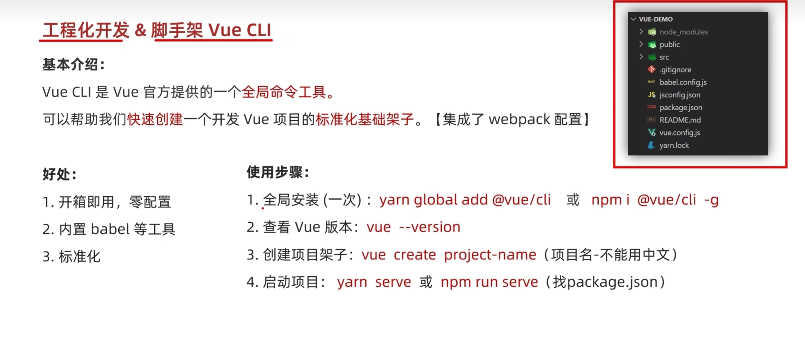
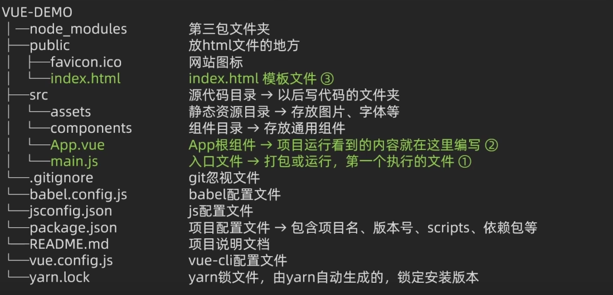
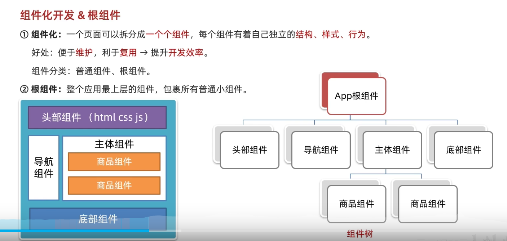
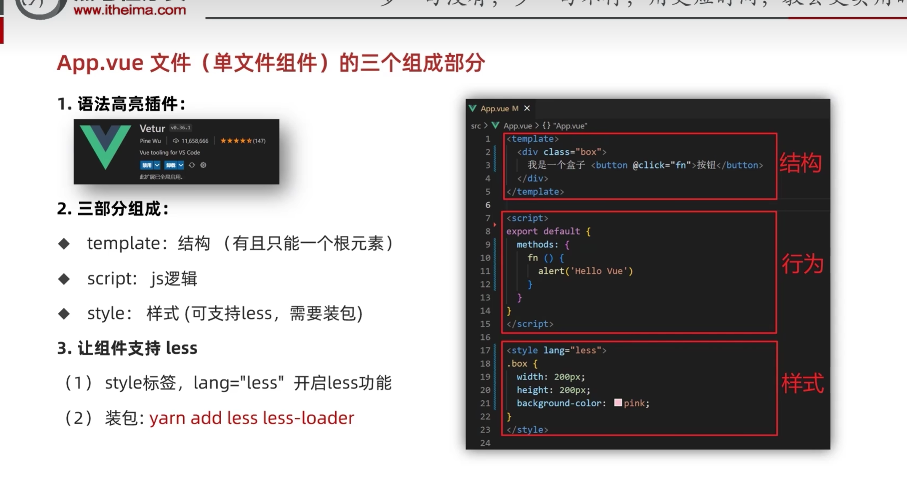
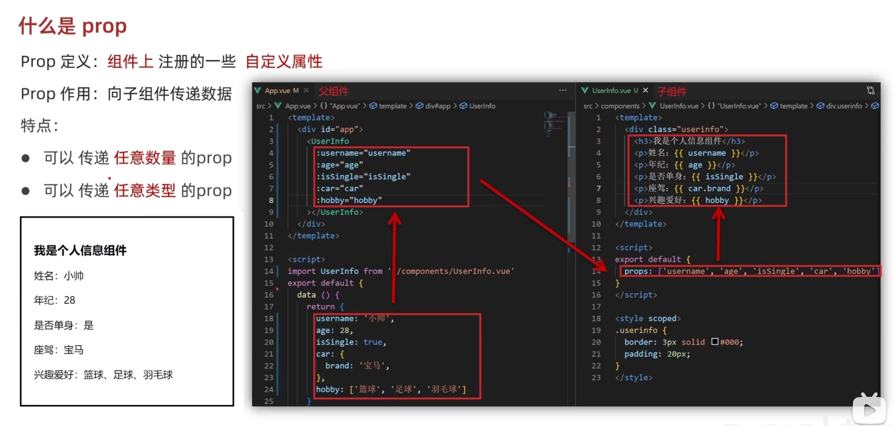

## 差值表达式 
### 一、差值表达式 `{{}}` 的基本概念
差值表达式 `{{}}` 是一种在模板中嵌入动态数据的语法，常见于 Vue.js、Angular 等前端框架。它的核心作用是将 JavaScript 表达式的计算结果渲染到 HTML 页面中。

### 二、差值表达式的核心特点
1. **表达式必须可被求值**  
   差值表达式内部只能包含 JavaScript 表达式，即那些能被 JavaScript 引擎计算出结果的代码片段。例如：
   ```html
   <!-- 正确：直接使用变量 -->
   <h3>{{ title }}</h3>
   
   <!-- 正确：调用方法（需确保nickname存在且有toUpperCase方法） -->
   <p>{{ nickname.toUpperCase() }}</p>
  
   <!-- 正确：三元表达式 -->
   <p>{{ age >= 18 ? '成年人' : '未成年人' }}</p>
   
   <!-- 正确：访问对象属性 -->
   <p>{{ obj.name }}</p>
   ```


2. **数据必须存在于作用域中**  
   表达式中引用的所有变量（如 `title`、`nickname`、`age`、`obj`）必须在当前模板的数据源（如 Vue 的 `data` 选项）中已定义，否则会导致渲染错误。

3. **仅支持表达式，不支持语句**  
   差值表达式中不能使用 JavaScript 语句（如 `if`、`for`、`while` 等），因为语句没有返回值。例如：
   ```html
   <!-- 错误：不能使用if语句 -->
   <p>{{ if (age >= 18) { '成年人' } else { '未成年人' } }}</p>
   
   <!-- 正确：应使用三元表达式替代if语句 -->
   <p>{{ age >= 18 ? '成年人' : '未成年人' }}</p>
   ```

### 三、为什么不能在标签属性中使用差值表达式？
在 HTML 标签的属性中直接使用 `{{}}` 会导致语法错误，因为浏览器解析 HTML 时不会识别这种语法。例如：
```html
<!-- 错误：标签属性中不能直接使用差值表达式 -->
<p title="{{ name }}">显示内容</p>
```


**正确做法**：使用框架提供的指令来绑定动态属性。例如：
```html
<!-- Vue.js 中使用 v-bind 指令绑定属性 -->
<p v-bind:title="name">显示内容</p>

<!-- 简写形式 -->
<p :title="name">显示内容</p>
```

## 指令的使用

###  v-html
```html
  v-html= '表达式' 动态设计元素innerHTML
   <div id="app">
    <div v-html = "msg"></div>
   </div>
   <script>
        const app = new Vue({
            el: '#app',
            data: {
                msg: "<h3>你好</h3>"
            }
    </script>
```
###  v-show 
```html
  v-show 控制元素显示隐藏 表达式true 显示 false 隐藏
  v-show是通过修改元素的 CSS display属性来实现显示和隐藏的。
  表达式的值为true，元素的display属性会恢复为默认值（例如block、inline等）。
  当表达式的值为false时，元素的display属性会被设置为none。
  使用场景：频繁切换显示隐藏场景
   <div id="app">
    <div v-show = "msg"></div>
   </div>
   <script>
        const app = new Vue({
            el: '#app',
            data: {
                msg: true
            }
    </script>
```
###  v-if
```html
  它是根据判断条件 控制元素的创建和移除
  表达式true 显示 false 隐藏
  使用场景：不频繁切换显示隐藏场景
   <div id="app">
    <div v-if = "msg"></div>
   </div>
   <script>
        const app = new Vue({
            el: '#app',
            data: {
                msg: true
            }
    </script>
```
### v-else
```html
   语法 v-else
   
```
### v-else-if 
```html
  语法 v-else-if = '表达式'
  
```
###  v-on 
```html
  语法 v-on 作用: 注册事件 = 添加监听 + 提供处理逻辑
  语法 v-on:事件名 = "内联语句 "v-on:click="count--"
  可以改成@click="count--"
  语法 v-on:事件名 = "methods中的函数名"
  v-on 调用传参
   <button v-on:click="count--">-</button>
    <span>{{count}}</span>
    <button @mouseenter="count++">+</button><br>
    <button @click='fu'>切换</button>
    <script>
        const app = new Vue({
            el: '#app',
            data: {
                count: 1000
            },
             methods: {
                fu() {
                    this.count += 2 
                    // 让提供的所有methods中的函数，this都指向当前实例
                }
            }
    </script>
```
### v-bind 
```html
借助v - bind，能够把表达式的值动态地绑定到 HTML 特性或者组件 prop 上。 
可以使用对象语法绑定多个 class 或者 style 值。
支持动态特性名，能在运行时确定绑定的特性。
绑定组件 prop 时，要保证子组件已声明该 prop。
作用： 动态的设置html的标签属性 -> src url title
 语法：v-bind:属性名 = “表达式” 可以简写为 :属性名 = “表达式”
  v - bind 对于样式控制的增强 - 操作class
    :class = "对象/数组"
    对象 -> 键就是类名，值是布尔值 如果值为true ,有这个类 否则没有
    < div class="box" : class="{ pink: true, big: true }" > 黑马程序员</ >
    数组 -> 数组中所以的类，都会添加到盒子上，本质就是一个class列表
    < div class="box" : class="['pink', 'big']" > 黑马程序员</ >
    v - bind 对于样式控制的增强 - 操作style
    :style  = "对象/数组"(对于某个属性的动态设置)
    < div class='box' : style = "{ width:'500px',height:'700px',backgroundColor: 'red' }" ></ >
   
```
### v -for 
```html
  v -for = "(item, index) in 数组"
 ➢ item 每一项， index 下标
key作用：
给元素添加的唯一标识，便于Vue进行列表项的正确排序复用。
注意点：
1. key的值只能是字符串或数字类型
2. key的值必须具有唯一性
3. 推荐使用id作为key（唯一），不推荐使用index作为key（会变化，不对应）
    <div id="app">
    <div v-for = "(item,index) in li":key = "item.id"></div>
   </div>
  <script>
        const app = new Vue({
            el: '#app',
            data: {
                li:[{name:"li",id:1},
                    {name:"li",id:2},
                    {name:"li",id:3},
                    {name:"li",id:4},
                ]
            }
    </script>
```
###  v-model 
```html
    v-model 语法  v-model = "表达式"
    作用：给表单元素使用，双向数据绑定 -> 可以快速获取 或 设置 表单元素内容
     前置理解：
    1. name:  给单选框加上 name 属性 可以分组 → 同一组互相会互斥
    2. value: 给单选框加上 value 属性，用于提交给后台的数据
       结合 Vue 使用 → v - model
    性别:
    <input v-model="gender" type="radio" name="gender" value="1">男
     <input v-model="gender" type="radio" name="gender" value="2">女
    前置理解：
    1. option 需要设置 value 值，提交给后台
    2. select 的 value 值，关联了选中的 option 的 value 值
    结合 Vue 使用 → v - model
    <select v - model="cityId" >
    <option value="101">北京</option>
    <option value="102">上海</option>
    <option value="103">成都</option>
    <option value="104">南京</option>
       </select>
  <div id="app">
       <input v-model="message" type="text" placeholder="请输入内容">
   </div>
  <script>
        const app = new Vue({

            el: '#app',
            data: {
                message:""
            }
    </script>
```
## 指令修饰符号
```html
 @keyup.enter -> 监听键盘回车事件
v-model.number 转数字
v-model.trim 去掉收尾空格
< h3 > @事件名.prevent  →  阻止默认行为</>
< h3 > @事件名.stop     →  阻止冒泡</>
```
## 计算属性
### computed
```html
    computed 作用：封装了一段对于数据的处理，算一个结果
    缓存特性(提高性能)计算属性会对应计算出来的结果缓存，再次使用
    再次使用直接读取缓存，依赖的变化了，会自动重新计算 ->再次合并
    语法:
    使用起来和普通属性一样使用{{计算属性名sum}}
    <script>
        computed: {
            sum:{
                 get(){
                改过程
                 // 将姓和名拼接为完整姓名
                 return this.name + this.ming;
            }，
                set(value){
                 改结果
                    // 将传入的完整姓名拆分为姓和名
                    // 例如：value = "张三" → name = "张", ming = "三"
                    this.name = value.slice(0, 1);  // 截取第一个字符作为姓
                    this.ming = value.slice(1);     // 截取剩余字符作为名
                    // 注意：修改 name 和 ming 会触发 sum 的 get 方法重新计算
             }
            }
        }
    </script>
```
### methods
```html
   <script>
    格式
    methods: {
        increment() {
            this.count++;
        },
        add(num) {
            this.count += num;
        },
        reset() {
            this.count = 0;
        }
    }
</script>

```
### methods VS computed
```html
用 computed 当：
需要 缓存结果（依赖不变时避免重复计算）。
结果 基于响应式数据派生（如过滤、拼接、计算）。
实现 双向绑定的派生属性（带 setter）。
用 methods 当：
需要 动态参数（如 reverseText(arg)，计算属性不支持参数）。
执行 一次性操作（如事件处理、数据初始化）。
不需要缓存（如简单函数，性能影响可忽略）。
```
### watch
```html
watch的简单使用
<script>
    // 创建 Vue 实例并挂载到 id 为 'app' 的 DOM 元素
    const app = new Vue({
        el: '#app',
        // 定义响应式数据
        data: {
            // 普通字符串属性，用于演示基本监听
            words: "",
            
            // 对象属性，用于演示嵌套属性的监听
            obj: {
                words: ""
            }
        },
        // 监听属性变化的选项
        watch: {
            // 监听顶级属性 'words' 的变化
            // 当直接修改 app.words 时会触发此回调
            words(newValue, oldValue) {
                // 打印新值和旧值，用于调试
                console.log("新值:", newValue);
                console.log("旧值:", oldValue);
            },
            // 监听嵌套属性 'obj.words' 的变化
            // 注意使用字符串路径语法来指定嵌套属性
            'obj.words'(newValue, oldValue) {
                // 打印对象内部属性的新值和旧值
                console.log("对象新值:", newValue);
                console.log("对象旧值:", oldValue);
            }
        }
    })
    watch的完整写法
   watch: {
    // 监听整个 obj 对象的变化（包括其内部属性的变化）
    obj: {
        // 立即执行一次 handler，在实例初始化时触发
        immediate: true,
        
        // 当 obj 对象或其内部属性发生变化时执行的回调函数
        // newValue: 变化后的 obj 对象
        // oldValue: 变化前的 obj 对象
        handler(newValue, oldValue) {
            // 使用 JSON.stringify 将对象转换为字符串，以便捕获变化瞬间的对象状态
            // 注意：由于 Vue 的响应式原理，当使用 deep: true 时，
            // newValue 和 oldValue 可能指向同一个对象（尤其是在对象内部属性变化时）
            // 这里使用 JSON.stringify 是为了在控制台显示变化前后的实际内容差异
            console.log('旧值:', JSON.stringify(oldValue));
            console.log('新值:', JSON.stringify(newValue));
        },
        
        // 深度监听：会遍历 obj 对象的所有属性，监听其变化
        // 即使修改嵌套很深的属性（如 obj.nested.property）也会触发此 watcher
        // 注意：深度监听会有性能开销，建议只在必要时使用
        deep: true
    }
}
}
</script>
```
## 生命周期

```html
定义: 一个vue实例创建到销毁的整个过程
生命周期的四个阶段:1.创建阶段 2.挂载阶段 3.更新阶段 4.销毁阶段

<script>
    new Vue({
  el: '#app',
  data() {
    return {
      count: 0,
      message: 'Hello Vue',
      list: []
    }
  },
  computed: {
    reversedMessage() {
      return this.message.split('').reverse().join('')
    }
  },

  // 1. 创建阶段（实例初始化）
  beforeCreate() {
    console.log('🚩 beforeCreate')
    console.log('  - 响应式数据: ', this.count)      // undefined
    console.log('  - DOM: ', this.$el)                // undefined
    console.log('  - 可访问: 仅 $options, $parent')
  },
  created() {
    console.log('🚩 created')
    console.log('  - 响应式数据: ', this.count)      // 0
    console.log('  - DOM: ', this.$el)                // undefined
    console.log('  - 可访问: data, methods, computed')
    
    // 适合发送初始化请求
    this.fetchData()
  },
  
  // 2. 挂载阶段（DOM 渲染）
  beforeMount() {
    console.log('🚩 beforeMount')
    console.log('  - 虚拟 DOM 已生成')
    console.log('  - 真实 DOM: ', document.querySelector('h3')) // null
  },
  mounted() {
    console.log('🚩 mounted')
    console.log('  - 真实 DOM 已挂载')
    console.log('  - 真实 DOM: ', document.querySelector('h3').textContent) // Hello Vue
    
    // 适合操作 DOM（如初始化第三方库）
    this.initChart()
    
    // 模拟数据更新，触发更新阶段
    setTimeout(() => {
      this.count = 10
    }, 2000)
  },
  
  // 3. 更新阶段（数据变化 → 视图更新）
  beforeUpdate() {
    console.log('🚩 beforeUpdate')
    console.log('  - 数据已变更: ', this.count)      // 10
    console.log('  - 视图尚未更新: ', document.querySelector('span').textContent) // 0
  },
  updated() {
    console.log('🚩 updated')
    console.log('  - 数据已变更: ', this.count)      // 10
    console.log('  - 视图已更新: ', document.querySelector('span').textContent) // 10
    
    // 注意：避免在此处修改数据，可能导致无限循环
  },
  
  // 4. 卸载阶段（实例销毁）
  beforeDestroy() {
    console.log('🚩 beforeDestroy')
    console.log('  - 实例即将销毁，但仍然完全可用')
    
    // 适合清理定时器、事件监听器等
    clearInterval(this.timer)
  },
  destroyed() {
    console.log('🚩 destroyed')
    console.log('  - 所有子实例已销毁，所有事件监听器和子实例已被移除')
    
    // 此处无法访问 Vue 实例属性和方法
  },
  
  methods: {
    fetchData() {
      // 模拟异步请求
      console.log('  🌐 发起数据请求...')
      setTimeout(() => {
        this.list = ['Item 1', 'Item 2', 'Item 3']
      }, 1000)
    },
    initChart() {
      // 模拟初始化图表库
      console.log('  📊 初始化图表库...')
    }
  }
})    
</script>
```
## 工程化开发和脚手架
### Vue CLI

```html
全局安装：改成 npm install -g @vue/cli
启动项目：yarn serve

vue3的配置
1.npm init vue@latest
2.......
```
### 项目目录介绍
#### 项目目录介绍

#### main.js
```html
<script>
  // 核心作用:导入app.vue,基于app.vue创建结构渲染index.html
// 导入Vue核心包
import Vue from 'vue'
// 导入app.vue 根组件
import App from './App.vue'
// 提示：当前处于什么环境（生产环境／开发环境）true 会显示对应的环境
Vue.config.productionTip = false
// vue实例化提供«render方法»→基于App.vue创建结构渲染index.html
new Vue({
  // el:"#app" = .$mount('#app')和$mount('选择器')作用一致，用于指定Vue所管理容器
  // render: (createElement) => {
// // 基于App创建元素结构
// return createElement(App)
  render: h => h(App),
}).$mount('#app')
</script>
```
#### index.html
```html
<!DOCTYPE html>
<html lang="">

<head>
  <meta charset="utf-8">
  <meta http-equiv="X-UA-Compatible" content="IE=edge">
  <meta name="viewport" content="width=device-width,initial-scale=1.0">
  <link rel="icon" href="<%= BASE_URL %>favicon.ico">
  <title>
    <%= htmlWebpackPlugin.options.title %>
  </title>
</head>

<body>
  <!-- 给不支持js的浏览器的一个提醒 -->
  <noscript>
    <strong>We're sorry but <%= htmlWebpackPlugin.options.title %> doesn't work properly without JavaScript enabled.
        Please enable it to continue.</strong>
  </noscript>
  <!-- vue管理的结构，将来动态创建渲染的数据 -->
  <div id="app">
    <!-- 工程化的开发模式中：这里不会直接编写语法  通过app.vue来提供渲染-->
  </div>
  <!-- built files will be auto injected -->
</body>

</html>
```
#### less安装
```html
<template>
  <div class = "app1" @click = "add()">我是结构html</div>
</template>
<script>
// 导出的当前组件的配置项
// 里面可以提供 data(特殊) methods computed watch 生命周期
export default{
  //js
  methods: {
    add(){
      console.log("hhhhh")
    }
  }
}
</script>
<style>
/* css */
/* 让style支持less
1. 给style加上 lang="less"
2. 安装依赖包 less less-loader
  yarn add less less-loader -D (开发依赖)
*/
  .app1 {
    width: 400px;
    height: 400px;
    background-color: red;
  }
</style>
```
#### app.Vue的组成


#### export default{...}常用选项
```html
data()定义组件内部数据
methods:定义组件方法
props:接受父件传递的数据
computed:计算属性
watch:监听数据变化
emits:生命自定义事件
生命周期钩子(如mounted,created等)
```
## 普通组件的注册使用
### 局部注册
```html
只能在注册的组件使用
1.创建.vue 文件(三部分组成)
2.在使用的组件内部导入注册
使用：
当html标签使用<组件名><组件名>
注意：
组件名规范——>像HmHeader HmFooter
导入需要注册的组件
<script>
import 组件对象 from '.vue文件路径'
import HmHeader from './components/HmHeader'
export default {
  //局部注册
  components: {
    组件名：组件对象
    HmHeader:HmHeader
  }
}
样例code
<template>
  <div class = "App">
    <!-- 此处可能有更多模板内容，图片中仅显示结束标签 -->
     <HmHeader> </HmHeader>
     <HmMain></HmMain>
     <HmFooter></HmFooter>
     
  </div>
</template>

<script>
import HmHeader from './components/HmHeader.vue';
import HmMain from './components/HmMain.vue';
import HmFooter from './components/HmFooter.vue';
export default {
  // 组件逻辑（当前为空）
  components: {
    HmHeader:HmHeader,
    HmMain:HmMain,
    HmFooter:HmFooter 
  }
}
</script>

<style>
.App {
  width: 600px;
  height: 700px;
  background-color: #87ceeb;
  margin: 0 auto;
  padding: 20px;
}
</style>
</script>
```
### 全局注册
```html
全局注册:所以的组件内可以注册
1.创建.vue文件(三个部分组成)
2.main.js中进行全局注册
语法：
// 导入需要全局注册的组件
import 组件对象 from '.vue文件路径'
// 调用Vue.component 进行全局注册
Vue.compoent('组件名'，组件对象)
3.html标签使用<组件名><组件名>
一般组件名 = 组件对象
```
### 组件拆分-页面开发
```html

1.分析页面,按模块拆分组件，搭架子(局部或者全局注册)
2.根据设计图,编写组件html结构css样式
3.差分封装通用小组件(局部或者全局注册)
将来-->通过js动态渲染,实现功能
```
## day 4
### scoped
```html
默认情况:写在组件中的样式会 全局生效 -> 因此会造成很多组件之间样式冲突问题
1.全局样式:默认组件中样式作用到全局
2.局部样式:可以给组件加上scoped属性,可以让样式只作用于当前组件
scoped 原理？
1.当前组价内标签都被添加data-v-hash值的属性
2.css 选择器都被添加[data-v-hash]的属性选择器
最终效果:必须是当前组件的元素，才会有这个自定义属性,才会被这个样式作用到
<style scoped>
/* 局部样式：只影响当前组件内的元素 */
.scoped-example p {
  color: green;
  font-size: 18px;
}

/* 编译后会变成类似：
.scoped-example p[data-v-123456] {
  color: green;
  font-size: 18px;
}
*/
</style>
```
### data是一个函数
```html
一个组件data选项必须是一个函数
目的：保证每个组件实例,维护独立的一份数据对象
<template>
  相当于每个事件独立，不影响
    <div>
        <div @click="count--">-</div>
        <div>{{ count }}</div>
        <div @click="count++">+</div>
    </div>
</template>
<script>
export default {
    data() {
        return {
            count:999
        }
    }
}
</script>
<style>
</style>
```
### 组件通信
#### prop & data
```html
共同点：都可以给组件提供数据。
区别：
● data 的数据是自己的 → 随便改 。
● prop 的数据是外部的 → 不能直接改，要遵循 单向数据流
```
#### props

props效验
```html
组件的props可以乱传吗？
作用: 为组件的prop指定验证要求,不符合要求，控制台会有错误提示
语法:
<!-- props:['title'] -->
props:{
  <!-- 效验属性名:类型 // Number String Boolean -->
   title:Number
}
props:{
  效验属性名：{
     type：类型 // Number String Boolean
     required:true // 是否必填
     default:默认值 
     validator(value){
      // 自定义效验逻辑
      return 是否通过效验
     }
  }
 
}
```
``` html 
props 的核心作用
数据传递：父组件通过 props 向子组件传递数据，实现单向数据流。
组件复用：通过 props 使组件可以根据不同参数动态渲染，增强复用性。
数据隔离：子组件不能直接修改 props 传入的数据（单向数据流原则）
父
<!-- 父组件 -->
<template>
    <div>
       我是App
       <!-- 引入子组件并传递title属性 -->
       <son :title="MyTitle"></son>
    </div>
</template>

<script>
// 导入子组件
import son from './son.vue'

export default {
    components: {
        // 注册子组件
        son
    },
    data() {
        return {
            // 定义传递给子组件的标题数据
            MyTitle: "学前端"
        }
    }
}
</script>
子
<template>
    <!-- 组件的模板部分，定义了组件在页面中呈现的结构 -->
    <div>
      我是son组件{{title}}
    </div>
</template>

<script>
// 导出Vue组件配置对象
export default {
    // 声明组件接收的props，通过props可以从父组件传递数据到子组件
    props:['title']
}
</script>
```
#### emit 
```html
核心作用
触发自定义事件：子组件通过 $emit 触发一个自定义事件，并可传递数据。
通知父组件：父组件可以监听这些事件并执行相应逻辑，从而实现子组件向父组件的数据传递。
父
<template>
    <div>
       我是App
       <!-- 引入子组件并传递title属性，绑定change-2事件处理函数 -->
       <son :title="MyTitle" @change-2="h"></son>
    </div>
</template>
<script>
// 导入子组件
import 组件对象 from '.vue文件路径'
export default {
    components: {
      // 注册子组件
      son: son
    },
    methods: {
      // 处理子组件触发的change-2事件
      h(new) {
        // 更新MyTitle数据
        this.MyTitle = new
      }
    },
    // 定义组件数据
    data() {
        return {
            MyTitle: "学前端"
        }
    }
}
</script>
子
<template>
    <div>
      我是son组件{{title}}
        <!-- 点击按钮触发change3方法 -->
        <button @click="change3">改</button>
    </div>
</template>
<script>
export default {
    // 定义接收的props
    props: ['title'],
    methods: {
      // 触发change-2自定义事件并传递新值
      change3() {
          this.$emit('change-2', '111111111')
      }
    }
}
</script>
```
### v-model 原理(详解)
#### 输入框上
```html
原理:v-model的本质就是value属性和input事件的结合
作用:提供数据的双向绑定
1.数据发生变化,页面会自动变:value
2.页面输入改变,数据会自动变@input
注意:$event 用于在模板中,获取事件的形参
<div>
  <!-- 使用 v-model 指令实现双向数据绑定（语法糖方式） -->
<input type="text" v-model="msg">
<!-- 手动拆分 v-model 为 value 绑定和 input 事件监听（等价实现） -->
<input type="text" 
       :value="msg"                <!-- 将 msg 数据渲染到输入框 -->
       @input="msg = $event.target.value"> <!-- 监听输入事件，更新 msg 数据 -->
</div>
```
#### 组件中
```html
表单组件 封装
① 父传子：数据应该是父组件 props 传递过来的，v-model 拆解 绑定数据
② 子传父：监听输入，子传父传值给父组件修改
<script>
  < BaseSelect
  :cityId="selectId"
  @事件名="selectId = $event"
/>
<select :value="cityId" @change="handleChange" ... />

props: {
  cityID: String
},
methods: {
  handleChange(e) {
    this.$emit('事件名', e.target.value)
  }
}
</script>
```
#### 组件中的简化写法
```html
表单类组件封装 & v-model 简化代码
2. 父组件 v-model 简化代码，实现子组件和父组件数据双向绑定
  ① 子组件中：props 通过 value 接收，事件触发 input
  ② 父组件中：v-model 给组件直接绑定数据（:value + @input）
父
<BaseSelect v-model="selectId" />
<BaseSelect :value="selectId" @input="selectId = $event" />
子
<select :value="value" @change="handleChange">...</select>

props: {
  value: String
},
methods: {
  handleChange(e) {
    this.$emit('input', e.target.value)
  }
}
```
#### sync
```html
作用:可以实现子组件与父组件数据的双向绑定,简化代码
特点:prop属性名,可以自定义，非固定为value
本质:就是 :属性名和@update:属性名 合写
< BaseDialog :visible.sync="isShow" />
--------------------------
< BaseDialog
  :visible="isShow"
  @update:visible="isShow = $event"
/>
子
props: {
  visible: Boolean
},
this.$emit('update:visible', false) 
```
### ref和$refs获取dom和组件
```html
作用:利用ref和$refs可以获取dom元素,或者组件实例
特点: 查找范围——> 当前组件内
1.获取dom：
目标标签-添加ref属性
<div ref="chartRef">我是在渲染图表的容器</div>
通过 this.$refs.xxx,获取目标标签
this.r$refs.chartRef

用于获取 DOM 元素或组件实例，实现父子组件间的交互（父组件访问子组件方法、属性 ）
二、获取组件步骤
1. 标记目标组件
在子组件标签上添加 ref 属性，作为唯一标识
vue
<BaseForm ref="baseForm"></BaseForm>

2. 调用组件方法
在父组件恰当的时机（如事件回调、生命周期钩子 ），通过 this.$refs.xxx 访问组件实例，调用其内部方法
js
// 调用 BaseForm 组件的自定义方法
this.$refs.baseForm.组件方法() 
```
### $nextTick 
```html
vue是异步更新
只要修改了 Vue 响应式数据，且需要立即操作受影响的 DOM，就用 $nextTick 包裹后续逻辑。
初始化依赖 DOM 尺寸的第三方库
只要涉及 “数据变化→DOM 更新→基于新 DOM 操作” 的时序问题，就用 $nextTick 保证你在 DOM 更新完成后再动手。
<script>
 数据变化后立即操作 DOM
 // 修改数据
this.message = '新内容';

// DOM 还未更新，直接操作 DOM 可能拿到旧值
console.log(this.$refs.box.textContent); // 可能还是旧内容

// 用 $nextTick 包裹，等 DOM 更新后执行
this.$nextTick(() => {
  console.log(this.$refs.box.textContent); // 输出“新内容”，拿到更新后的值
});
created 钩子中操作 DOM（mounted 前 DOM 未渲染完成）
created() {
  this.$nextTick(() => {
    // DOM 渲染后执行，生效
    this.$refs.box.innerHTML = '初始化内容'; 
  });
}
}
添加 / 删除列表项后，操作新渲染的 DOM 元素
methods: {
  addItem() {
    this.list.push({ id: Date.now(), name: '新项' });
    
    this.$nextTick(() => {
      // 滚动到新增的列表项
      const newItem = this.$el.querySelector(`[data-id="${this.list.at(-1).id}"]`);
      newItem.scrollIntoView({ behavior: 'smooth' });
    });
  }
}
</script>
```
## day 5
### 自定义指令-基础语法
#### 全局
```html
 Vue.directive 是 Vue 提供的用于全局注册自定义指令的 API
第一个参数 '指令名' 是自定义指令的名称，使用时需以 v-指令名 的形式用在 DOM 元素上，比如 v-focus
Vue.directive('指令名', {
 inserted 是自定义指令的一个钩子函数，属于指令的生命周期钩子之一
指令绑定的 DOM 元素被插入到父节点（DOM 树中）时，这个钩子函数会被调用
参数 el 就是当前指令所绑定的那个 DOM 元素（比如绑定在 <input> 上，el 就指向该 <input> 元素）
  "inserted"(el) { 
    在这里可以对 el 这个 DOM 元素进行操作，来扩展额外的功能
    下面这行代码就是调用 DOM 元素的 focus 方法，让元素自动获取焦点（常见用于输入框等元素）
    el.focus() 
  }
})
```
#### 局部
```html
directives: {
   指令名：自定义指令的名称，使用时需以 v-指令名 的形式用在当前组件的 DOM 元素上（比如 v-focus）
  指令名: { 
    inserted：指令的钩子函数之一
     触发时机：当指令绑定的 DOM 元素被插入到父节点（DOM 树中）时调用
    参数 el：当前指令绑定的 DOM 元素（比如绑定在 <input> 上，el 就指向该 <input> 元素）
    inserted(el) { 
    在这里可以对 el 这个 DOM 元素进行操作，扩展额外功能
    示例：调用 DOM 元素的 focus 方法，让输入框自动获取焦点
      el.focus() 
    }
  }
}
```
```vue
<template>
  <div>
    <h1 v-color="color1">指令的值1测试</h1>
    <h1 v-color="color2">指令的值2测试</h1>
  </div>
</template>

<script>
export default {
  data () {
    return {
      color1: 'red',
      color2: 'orange'
    }
  },
  directives: {
    color: {
      inserted(el,bingding){
        el.style.color = bingding.value
      }
    }
  }
  }

</script>

<style>

</style>
```
### v-loading 指令封装
```html
对于自定义指令-基础语法的使用，此处省略......
```
### 插槽
#### 默认插槽
```html
就是调用子组件很多次,但是要求每一次调用一些地方不一样
<!-- 布局组件 -->
<template>
  <div class="card">
    <slot></slot> <!-- 内容区 如果这个地方不一样就使用slot-->
  </div>
</template>

<!-- 使用 -->

<!-- 父组件模板 -->
<template>
  <div>
    <MyComponent>
      <!-- 这里的内容会被插入到组件的默认插槽位置 -->
      <p>这是插入到默认插槽的内容</p>
      <!-- 这里搞你想要的内容 -->
    </MyComponent>
  </div>
</template>
```
#### 后备内容(默认值)
```html
在封装 Vue 组件时，可给预留的 <slot> 插槽设置后备内容（默认内容）。当外部使用组件未传入内容时，插槽显示后备内容；传入内容则替换后备内容整体渲染。
二、语法与效果
（一）语法
在组件模板的 <slot> 标签内，直接放置内容，作为默认显示内容，示例：
vue
<template>
  <div class="dialog">
    <div class="dialog-content">
      <!-- 在 slot 标签内写内容，作为后备内容 -->
      <slot>我是后备内容</slot> 
    </div>
  </div>
</template>
（二）效果
外部不传内容：
使用组件时标签内无内容，如 <MyDialog></MyDialog> ，此时插槽会显示 <slot> 内的后备内容（“我是后备内容” ）。
外部传内容：
使用组件时标签内有内容，如 <MyDialog>我是内容</MyDialog> ，则 <slot> 整体被替换，渲染传入的内容（“我是内容” ）。

```
#### 具名插槽
```html
为什么要使用具名插槽 ？
想象一个 Card 组件，它需要：
一个标题区域（不同页面卡片标题可能不同）
一个内容区域（卡片主体内容不同）
一个操作按钮区域（比如 “查看详情” 或 “删除”，不同场景按钮不同）
如果只用 默认插槽，无法区分这 3 块区域。具名插槽允许给每个插槽起一个唯一名字，父组件就能精准把内容 “填” 到对应位置。
语法:
子（以 Card.vue 为例，用 <slot name="xxx"> 声明具名插槽）
<template>
  <div class="card">
    <!-- 具名插槽：标题 -->
    <slot name="title">
      <!-- 这里是默认内容，父组件没传的话会显示 -->
      <h2>默认标题</h2>
    </slot>

    <!-- 具名插槽：内容 -->
    <slot name="content">
      <p>默认内容...</p>
    </slot>

    <!-- 具名插槽：操作 -->
    <slot name="action">
      <button>默认按钮</button>
    </slot>
  </div>
</template>
父
（用 v-slot:插槽名 或简写 #插槽名，把内容对应到子组件的插槽）
但是要加<template></template>
<template>
  <div>
    <!-- 调用 Card 组件，用具名插槽传内容 -->
    <Card>
      <!-- 标题区域：对应子组件 name="title" 的插槽 -->
      <template #title>
         <!-- #title = v-slot:title -->
        <h2>我的自定义标题</h2>
      </template>
      <!-- 内容区域：对应子组件 name="content" 的插槽 -->
      <template #content>
        <p>这是卡片的具体内容...</p>
      </template>

      <!-- 操作区域：对应子组件 name="action" 的插槽 -->
      <template #action>
        <button @click="handleClick">查看详情</button>
      </template>
    </Card>
  </div>
</template>

<script setup>
import Card from './Card.vue'
const handleClick = () => {
  alert('点击了查看详情～')
}
</script>

```
#### 作用域插槽
```html
定义slot插槽的同时,是可以传值的,给插槽上可以绑定数据,将来使用组件时可以使用
场景:封装表格组件
1.父传子，动态渲染表格内容
2.利用默认插槽，定制操作列
3.删除或查看都需要用到当前项的 id，属于组件内部的数据
基本使用步骤:
给 slot 标签，以添加属性的方式传值
<slot :id="item.id" msg="测试文本"></slot>
所有添加的属性，都会被收集到一个对象中
{id: 3, msg: ' 测试文本 '}
在 template 中，通过 #插槽名="obj" 接收，默认插槽名为 default
<MyTable :list="list">
<template #default="obj">
<button @click="del (obj.id)"> 删除</button>
</template>
</MyTable>
<!-- 子组件 -->
<template>
  <table class="my-table">
   
    <tbody>
      <tr v-for="(item, index) in data" :key="item.id">
        <td>{{ index + 1 }}</td>
        <td>{{ item.name }}</td>
        <td>{{ item.age }}</td>
        <td>
          <!-- 1. 给slot标签，添加属性的方式传值 -->
          <slot :row="item" ></slot>
  **        <!-- 2. 将所有的属性，添加到一个对象中 -->
          <!-- 
             {
               row: { id: 2, name: '孙大明', age: 19 },
               msg: '测试文本'
             }
           -->
        </td>
      </tr>
    </tbody>
  </table>
</template>

<script>
export default {
  props: {
    data: Array
  }
}
</script>
父组件
<template>
  <div>
    <MyTable :data="list">
      <!-- 3. 通过template #插槽名="变量名" 接收 -->
    <template #default="obj">
  <!-- 
    使用作用域插槽接收子组件传递的数据
    obj是子组件暴露的包含行数据的对象，结构通常为：
    {
      row: { id, name, age, ... }, // 当前行的完整数据
      index: Number, // 当前行的索引
      ... // 子组件可能暴露的其他属性
    }
  -->
  <button  @click="del(obj.row.id)">
    删除
  </button>
</template>
    </MyTable>
  </div>
</template>

<script>
import MyTable from './components/MyTable.vue'
export default {
  data () {
    return {
      list: [
        { id: 1, name: '张小花', age: 18 },
        { id: 2, name: '孙大明', age: 19 },
        { id: 3, name: '刘德忠', age: 17 },
      ],
    }
  },
  methods: {
    del (id) {
      this.list = this.list.filter(item => item.id !== id)
    },
    show (row) {
      // console.log(row);
      alert(`姓名：${row.name}; 年纪：${row.age}`)
    }
  },
  components: {
    MyTable
  }
}
</script>

```
### 单页面应用程序
```html
什么是单页面程序？
所以的功能都在一个html页面上实现
单页面应用的优缺点？
优点: 按需求更新性能,开发效率高,用户体验好
缺点: 学习成本,首页加载慢,不利于SEO
应用场景？
系统类网站/内部网站/文档类网站/移动端站点
```
### 路由
#### 路由定义
```html
什么是路由？
路由是一种映射关系
Vue 中的路由是什么？
路径和组件的映射关系
根据路由就能知道不同路径的，应该匹配渲染哪个组件
```
#### 路由基本使用
```js
5个基础步骤(固定)(main.js)
1.下载: 下载VueRouter模块到当前工程，版本3.6.5
yarn add vue-router@3.6.5
2.引入
import VueRouter from 'vue-router'
3.安装注册
Vue.use(VueRouter)
4.创建路由对象
const router = new VueRouter()
5.注入，将路由对象注入到new Vue 实例中,建立关联
new Vue({
  render: h => h(App),
  router
}).$mount('#app')
2个核心步骤：
1.创建需要的组件(views目录)，配置路由规则
Find.vue  My.vue  Friend.vue
(main.js)
import Find from './views/Find.vue'
import My from './views/My.vue'
import Friend from './views/Friend.vue'

const router = new VueRouter({
  routes: [
    { path: '/find', component: Find },
    { path: '/my', component: My },
    { path: '/friend', component: Friend },
  ]
})
2.配置导航,配置路由出口(路径匹配的组件显示的位置)
<!-- footer_wrap 容器，一般用于放置底部导航相关内容 -->
<div class="footer_wrap">
  <!-- 
    导航链接，使用 href="#/find" 形式，是 Vue Router 哈希模式下的路由跳转写法。
    点击该链接时，URL 中的哈希部分会变为 #/find，Vue Router 会根据配置的路由规则，
    匹配对应的组件并渲染到 <router-view></router-view> 位置。
    这里是“发现音乐”功能的导航，点击后会展示与 /find 路由关联的组件 
  -->
  <a href="#/find">发现音乐</a>
  <!-- 
    同理，点击该链接，URL 哈希变为 #/my，用于展示“我的音乐”相关功能组件 
  -->
  <a href="#/my">我的音乐</a>
  <!-- 
    点击后 URL 哈希变为 #/friend，用于展示“朋友”相关功能组件 
  -->
  <a href="#/friend">朋友</a>
</div>
<!-- top 容器，一般用于放置页面主体内容展示区域 -->
<div class="top">
  <!-- 
    router-view 是 Vue Router 提供的占位组件。
    当 URL 中的哈希（或 history 模式下的路径）匹配到配置的路由规则时，
    对应的组件就会渲染到这个位置，实现单页应用（SPA）中不同页面内容的动态切换 
  -->
  <router-view></router-view>
</div>
```
#### 怎么使用二级路径
```js
在router中的index.js (其他方法一样)
导入组件 import Find from '@/views/Find'
import My from '@/views/My'
import Friend from '@/views/Friend'
// router/index.js
import { createRouter, createWebHistory } from 'vue-router';

const routes = [
  {
    path: '/user/:id',
    component: () => import('@/views/User.vue'),
    children: [
      {
        path: 'profile', // 完整路径: /user/:id/profile
        component: () => import('@/views/UserProfile.vue')
      },
      {
        path: 'posts', // 完整路径: /user/:id/posts
        component: () => import('@/views/UserPosts.vue')
      }
    ]
  }
];
export default router;
在对应的页面使用 <router-view/> 来渲染子路由对应的组件。
```
#### 组件的分类
```html
组件分类及目的
分类：页面组件、复用组件
目的：便于项目维护
组件存储位置与作用
页面组件
存储：views 文件夹
作用：配合路由，负责页面整体展示
复用组件
存储：components 文件夹
作用：封装通用功能 / UI，支持多场景复用

页面组件（Page Components）：
作用：对应路由的「页面级容器」，比如 /find /my 等路由各自匹配的页面，承担整体页面布局、业务流程串联职责（比如 “发现音乐” 页面要整合轮播图、推荐歌单等模块）。
特点：一般不复用（或极少复用），一个路由对应一个页面组件；
复用组件
作用：聚焦单一功能 / UI 片段的封装（比如按钮、弹窗、歌单卡片），解决 “多个页面 / 场景需要重复实现相同功能” 的问题，像音乐 App 里每个歌单列表都用到的「歌单卡片组件」。
特点：可在多个页面组件、甚至其他复用组件中嵌套使用，强调复用性、通用性。
```
## day 6
### 路由的封装抽离
```js
问题：所有路由配置堆在 main.js 是否合适
目标：抽离路由模块
好处：拆分模块，利于维护
在src 建立一个router 文件
在router 中建立index.js
1.导入 vue
import Vue from 'vue'
2.引入
import VueRouter from 'vue-router'
3.安装注册
Vue.use(VueRouter)
4.创建路由对象
import Find from '@/views/Find'
import My from '@/views/My'(基于 @ 指代 src 目录，从 src 目录出发找组件)
import Friend from '@/views/Friend'

const router = new VueRouter({
  routes:[
    {path: '/find', component: Find},
    {path: '/my', component: My},
    {path: '/friend', component: Friend},
  ]
})
5.导出 export default router
6. 在main.js的操作
6.1 引入路由配置
import router from './router/index.js'
6.2 .注入，将路由对象注入到new Vue 实例中,建立关联
new Vue({
  render: h => h(App),
  router
}).$mount('#app')
```
### 声明式导航-导航链接
```js
要求:实现导航高亮效果
vue-rounter 提供了一个全局组件router-link(取代a标签)
1.能跳转，配置to属性指定路径(必须).本质还是a标签,to 无需 #
2.能高亮, 默认就会提供高亮类名,可以直接设计高亮样式

<router-link to="/find">发现音乐</router-link> 等价
 <a href="#/find">发现音乐</a>

能高亮的操作
<style>
  a.router-link-active {
  background-color: purple;
}
或者

  a.router-link-exact-active {
  background-color: purple;
}
</style>
① router-link-active 模糊匹配（用的多）
to="/my" 可以匹配 /my/my/a/my/b .....
② router-link-exact-active 精确匹配
to="/my" 仅可以匹配 /my

```
### 自定义匹配的类名
```js
说明：router-link 的两个高亮类名 太长了，我们希望能定制怎么办？
// 创建Vue Router实例，用于实现单页应用的路由功能
//在router 中index.js中
const router = new VueRouter({
  routes: [...], 
  // 自定义路由链接激活时的CSS类名
  // 当路由匹配成功时，对应的router-link会自动添加这个类名
  // 默认为"router-link-active"，这里修改为"类名1"，用于控制导航高亮等效果
  linkActiveClass: '类名1',//模糊匹配（用的多）

  // 自定义路由链接精确激活时的CSS类名
  // 只有当URL与路由配置的path完全一致时才会添加这个类名
  // 默认为"router-link-exact-active"，这里修改为"类名2"
  // 用于区分"完全匹配"和"包含匹配"的不同样式需求
  linkExactActiveClass: '类名2'，//精确匹配
})
在改下样式
<style>
  a.类名1 {
  background-color: purple;
}
或者

  a.类名2 {
  background-color: purple;
}
</style>
```
### 声明式导航-跳转传参
#### 动态路由传参
```js
优点: 优雅简洁,传单个参数比较方便
1.配置动态路由：path:"/path/:参数名？"
// 创建 VueRouter 实例，配置应用的路由规则
const router = new VueRouter({
  routes: [
    // 定义首页路由，访问路径为 /home
    // 当用户访问该路径时，渲染 Home 组件
    { 
      path: '/home', 
      component: Home 
    },
    // 定义搜索页面路由，使用动态路径参数 :words
    // 路径中的 ? 表示该参数可选（即 /search 和 /search/关键词 都有效）
    // 组件内部可通过 $route.params.words 获取搜索关键词
    { 
      path: '/search/:words?', 
      component: Search 
    }
  ]
})
2.跳转：to = "/path/参数值"
<router-link to="/search/黑马程序员">黑马程序员</router-link>
<router-link to="/search/前端培训">前端培训</router-link>
<router-link to="/search/如何成为前端大牛">如何成为前端大牛</router-link>
3.获取: $route.params.参数名
<p>搜索关键字: {{ $route.params.words }} </p>
created () {
    // 在created中，获取路由参数
    // this.$route.params.参数名 获取动态路由参数
    console.log(this.$route.params.words);
  }
```
#### 查询参数传参
```js
优点:比较适合传多个参数
1.配置动态路由: 正常配置
2. 跳转：to="/path?参数名=值&参数名2=值"
3. 获取：$route.query.参数名”
created () {
    // 在created中，获取路由参数
    // this.$route.query.参数名 获取查询参数
  }
}
```
#### 路由重定向
```js
问题：网页打开后，url 默认为 / 路径，未匹配到组件时，会出现空白
说明：重定向 → 匹配 path 后，强制跳转 path 路径
语法：{ path: 匹配路径, redirect: 重定向到的路径 }
{path: '/',redirect: '/home'}, 

问题：Vue路由 - 404
作用：当路径找不到匹配时，给出提示页面
位置：配在路由最后
语法：path: "*"（任意路径）- 前面不匹配就中最后这个
 {path:'*',component: NotFind} (写在最后一个)

在views 建一个NotFind
<template>
    <div class="not-found">
        <h1>404 Not Found</h1>
        <p>抱歉，您访问的页面不存在。</p>
        <router-link to="/home">返回首页</router-link>
    </div>
</template>
<script>
export default {
}
</script>
<style>
</style>
在router 中index.js 
导入 import NotFind from '@/views/NotFind'

 Vue路由 - 模式设置
问题: 路由的路看起来不自然，有#, 能否切成真实路径格式？
hash路由(默认) 例如：http://localhost:8080/#/home
history路由(常用) 例如：http://localhost:8080/home（以后上线需要服务器端支持）
const router = new VueRouter({
  mode: 'history', // 使用HTML5的history模式
})
```
### 编程式导航-基本跳转
```js
问题:点击按钮跳转怎么写？
编程式导航：通过js代码，实现路由跳转
两个方法：

1.path 路径跳转（简易方便）
methods: {
  toHome () {
    // 使用编程式导航，跳转到 /home 路径
    // this.$router.push('/home')[简写]
    this.$router.push({ 
      path: '/home' 
      })[完整写法]
  }
}
2.name 名称跳转（适合路径名字长的场景）
{ name: '路径名', path: '/path/xxx', ... }
methods: {
  toHome () {
    // 使用编程式导航，跳转到名称为 home 的路由
    // this.$router.push({ name: 'home' })[简写]
    this.$router.push({
      name: 'home'
      })[完整写法]
  } 
}
// 1. 通过路径的方式跳转 - 直接使用路径字符串进行路由跳转
// (1) 简化写法 - 直接传递路由路径字符串
//     普通跳转：this.$router.push('路由路径')
//     带query参数跳转：this.$router.push('路由路径?参数名=参数值')
//     带动态路由参数跳转：this.$router.push(`/search/${this.inpValue}`)
// this.$router.push('/search')  // 跳转到/search路径
// this.$router.push(`/search?key=${this.inpValue}`)  // 通过query方式传参，URL显示为/search?key=xxx
// this.$router.push(`/search/${this.inpValue}`)  // 通过动态路由方式传参，需要路由配置中定义:key

// (2) 对象完整写法 - 更适合复杂参数传递
//     通过path指定路由路径
//     通过query对象传递参数（类似GET请求参数，会显示在URL中）
// this.$router.push({
//   path: '/search',
//   query: {
//     key: this.inpValue  // 传递参数，URL显示为/search?key=xxx
//   }
// })
params
// this.$router.push({
//   path: `/search/${this.inpValue}`  // 传递动态路由参数，需要路由配置中定义:key
// })

// 2. 通过命名路由的方式跳转 (需要在路由配置中给路由起名字)
//    适合复杂路径或需要传递多种参数的场景
//    通过name指定路由名称
//    通过query传递查询参数（会显示在URL中）
//    通过params传递动态参数（不会显示在URL中，需要路由配置中定义）
// this.$router.push({
//   name: 'search',  // 路由配置中定义的name
//   // query: {
//   //   key: this.inpValue  // 传递查询参数，URL显示为/search?key=xxx
//   // }
//   params: {
//     words: this.inpValue  // 传递动态参数，需要路由配置中定义:words
//   }
// })

```
### vuex的基本认知
```js
vuex 是什么？
vuex 是 vue 官方提供的状态管理工具，用于集中式管理 vue 应用的状态
vuex 是一个插件,可以帮我们管理vue通用的数据(多组件共享的数据)
场景：
1.在很多组件来使用(个人信息)
2.多个组件共同维护一份数据(购物车)
优势
1.集中式管理状态，便于维护
2.响应式变化
3.操作简单

```
####  创建一个空仓库
```js
1. yarn add vuex@3
2. 导入 vuex 模块
在src中新建一个store文件夹
在store 中新建一个index.js
import Vue from 'vue'
import Vuex from 'vuex'
3. 安装注册
Vue.use(Vuex)
4. 创建仓库对象
const store = new Vuex.Store({
 
})
export default store
在main.js中
import store from './store/index.js'
new Vue({
  render: h => h(App),
  store
}).$mount('#app')
```
####  如何提供&访问vuex的数据
```js
提供数据
const store = new Vuex.Store({
  state: {
    // 定义共享的数据
    userInfo: {
      name: '张三',
      age: 18
    } 
  }
})
访问数据
模版中:{{ $store.state.userInfo.name }}
组件逻辑中: this.$store.state.userInfo.name
js模块中: store.state.userInfo.name
简化写法
在需要访问数据的页面
import { mapState } from 'vuex'
export default {
  computed: {
    // 使用mapState辅助函数，简化数据的访问
    // 直接从store的state中解构出userInfo对象
    ...mapState(['userInfo'])
  }
}
然后在模版中直接使用userInfo.name即可
```
####  如何修改vuex的数据(mutations)
目标：明确 vuex 同样遵循单向数据流，组件中不能直接修改仓库的数据
通过 strict: true 可以开启严格模式
state 中定义的数据，只能通过 mutations 修改
```js
在store 中index.js
const store = new Vuex.Store({
state: {
  cout:100
  } ,
  定义mutations(只可以传一个值，如果有多个那么要使用对象)
  mutations: {
    // 定义一个名为add的mutation
    // 第一个参数是state，即仓库中的状态
    // 第二个参数是payload，即传递给mutation的数据
    add (state,payload) {
      // 修改state中的count值
      state.cout += payload
    }
  }
})
在组件中
import { mapMutations } from 'vuex'
methods: {
  // 定义一个名为handleAdd的方法
  // 该方法会触发名为add的mutation
  // 并传递一个值为10的payload
  handleAdd (n) {
    this.$store.commit('add', n)
  }
}
在模版中
<button @click="handleAdd(10)">加10</button>

```
#### mapMutations的使用
```js
mapMutations的使用
mutations: {
  // 定义一个 mutation：接收 state 和参数 n，执行 state.count -= n
  subCount (state, n) {
    state.count -= n  
  }
}
import { mapMutations } from 'vuex'  

export default {
  methods: {
    // 关键：用 ...mapMutations 把 mutations 里的 subCount 映射到组件 methods
    ...mapMutations(['subCount'])  
  }
}
等价于
methods: {
  subCount (n) {
    this.$store.commit('subCount', n)  
  }
}
在模版中
<button @click="add(10)">加10</button>

```
#### actions的使用(异步操作)
mutations 中不能处理异步操作
```js
mutations: {
add(state, n) {
  state.count += n 
}
actions: {
  // 定义一个名为addAsync的action
  // 第一个参数是context，包含commit方法
  // 第二个参数是payload，即传递给action的数据
  Async add(context, payload) {
    // 异步操作，例如发送请求
    setTimeout(() => {
      // 调用commit方法，触发名为add的mutation
      // 并传递一个值为payload的payload
      context.commit('add', payload) 
    }) 
  }
}
页面中
methods: {
  // 定义一个名为handleAddAsync的方法
  // 该方法会触发名为addAsync的action
  // 并传递一个值为10的payload
  handleAddAsync (n) {
    this.$store.dispatch('addAsync', n)
  }
}
```
#### mapActions的使用
```js
mapActions是vuex提供的辅助函数，用于简化actions的使用
mapActions的使用
actions: {
  // 定义一个名为addAsync的action
  // 第一个参数是context，包含commit方法
  // 第二个参数是payload，即传递给action的数据
  addAsync (context, payload) {
  setTimeout(() => {
      // 调用commit方法，触发名为add的mutation
      // 并传递一个值为payload的payload
      context.commit('add', payload)
    })
  } 
}
import { mapActions } from 'vuex'
export default {
  methods: {
    // 关键：用...mapActions 把 actions 里的 addAsync 映射到组件 methods
    ...mapActions(['addAsync'])
  }
}
this.addAsync(10) = this.$store.dispatch('addAsync', 10)
```
#### getters的使用
```js
getters类似于vue中的计算属性(computer)，用于从state中派生出一些状态
state: {
list: [1, 2, 3, 4, 5,6,7,8,9,10] 
}
getters: {
  // 定义一个名为evenList的getter
  // 该getter接收state作为参数
  // 返回一个新的数组，包含list中所有偶数
  evenList (state) {
    return state.list.filter(item => item % 2 === 0)
  }
}
页面中
computed: {
  // 计算属性：从store的getters中获取evenList
  evenList () {
    return this.$store.getters.evenList
  }
}
```
#### mapGetters的使用
```js
mapGetters是vuex提供的辅助函数，用于简化getters的使用
mapGetters的使用
getters: {
  // 定义一个名为evenList的getter
  evenList (state) {
    return state.list.filter(item => item % 2 === 0)
  } 
}
import { mapGetters } from 'vuex'
export default {
  computed: {
    // 关键：用...mapGetters 把 getters 里的 evenList 映射到组件 computed
   ...mapGetters(['evenList'])
  }
}
this.evenList = this.$store.getters.evenList
<div>{{evenList}}</div>//调用
```
#### 四个map的异同点
```js
属性
computed: {
    ...mapState(['name', 'age']),
    ...mapGetters(['getAge'])
  },
  methods: {
    ...mapMutations(['add', 'age']),
    ...mapActions(['addd'])
    // aaa (n) {
    //   this.$store.dispatch('addd', n)
    // }

  }
  ```

#### modules的使用(模块化)
  由于vuex的store是单一状态树，当项目比较大时，会出现很多状态
  为了避免命名冲突，我们可以将store分成多个模块
  每个模块拥有自己的state、mutations、actions、getters

  在store 中建立一个modules文件夹
  在modules 中建立一个user.js 等 其他js文件 
  在user.js中
```js
const state = {}
const mutations = {}
const actions = {}
const getters = {}
export default {
state,
mutations,
actions,
getters 
}
在 store 中index.js中
import user from './modules/user'
const store = new Vuex.Store({
  modules: {
  user
 }
  }
})

```
####  modules中使用4个方法
state 
尽管在不同模块中定义了同名的state，但是state还是在根级上进行合并的，
```js
const state = {
 name: '张三'
}
直接使用 this.$store.state.user.name
子模块映射 mapState('user', ['name'])
注要开启 namespace: true ，否则会报错
export default {
namespace: true,
state,
mutations,
actions, 
}
```
getters
```js
const getters = {
  getName (state) {
    return state.name
  } 
}
直接使用 this.$store.getters['user/getName']
子模块映射 mapGetters('user', ['getName'])
注要开启 namespace: true ，否则会报错
```
matutions
```js
const mutations = {
  setName (state, name) {
    state.name = name
  }
}
this.$store.commit('user/setName', '李四')
子模块映射 mapMutations('user', ['setName'])
注要开启 namespace: true ，否则会报错
```
actions
```js
const actions = {
  setName (context, name) {
    setTimeout(() => {
      context.commit('setName', name) 
    },1000)
   
  }
}
this.$store.dispatch('user/setName', '李四')
...mapActions('user', ['setName'])
注要开启 namespace: true ，否则会报错
```

## day 7
### vant 
#### 全部导入
1.安装 vant-ui
```js
yarn add vant@latest-v2
```
2.在main.js中注册
```js
import Vant from 'vant'
import 'vant/lib/index.css'
Vue.use(Vant)
```
3.使用
```js
<van-button type="primary">主要按钮</van-button>
<van-button type="info">信息按钮</van-button>
```
#### 按需导入
1.安装 vant-ui
```js
yarn add vant@latest-v2
```
2.安装插件
```js
yarn add babel-plugin-import -D
```
3.在babel.config.js中配置
```js
module.exports = {
  presets: [
    '@vue/cli-plugin-babel/preset'
  ],
  plugins: [
    ['import', {
      libraryName: 'vant',
      libraryDirectory: 'es',
      style: true
    }]
  ]
}
```
4.在utils中建立vant-ui.js文件
引入需要的ui
```js
import Vue from 'vue'
import { Tabbar, TabbarItem } from 'vant'
Vue.use(Tabbar)
Vue.use(TabbarItem)
```
5.在main.js中引入
```js
import './utils/vant-ui'
```
6.使用
```js
<van-button type="primary">主要按钮</van-button>
<van-button type="info">信息按钮</van-button>
```
### postcss插件-实现vw适配
① 安装插件
```js
yarn add postcss-px-to-viewport@1.1.1 -D
```
② 根目录新建 postcss.config.js 文件，填入配置
```js
// postcssrc.config.js
module.exports = {
  plugins: {
    'postcss-px-to-viewport': {
      // 标准屏宽度
      viewportWidth: 375
    }
  }
}
```
### request模块 - axios封装
接口文档：https://apifox.com/apidoc/shared-12ab6b18-adc2-444c-ad11-0e60f5693f66/doc-2221080

演示地址：http://cba.itlike.com/public/mweb/#/

基地址：http://cba.itlike.com/public/index.php?s=/api/

我们会使用 axios 来请求后端接口, 一般都会对 axios 进行一些配置 (比如: 配置基础地址,请求响应拦截器等等)

一般项目开发中, 都会对 axios 进行基本的二次封装, 单独封装到一个模块中, 便于使用

目标：将 axios 请求方法，封装到 request 模块

安装 axios
```bash
npm i axios
```
新建 utils/request.js 封装 axios 模块

利用 axios.create 创建一个自定义的 axios 来使用

http://www.axios-js.com/zh-cn/docs/#axios-create-config
```js
/* 封装axios用于发送请求 */
import axios from 'axios'

// 创建一个新的axios实例
const request = axios.create({
  baseURL: 'http://cba.itlike.com/public/index.php?s=/api/',
  timeout: 5000
})

// 添加请求拦截器
request.interceptors.request.use(function (config) {
  // 在发送请求之前做些什么
  return config
}, function (error) {
  // 对请求错误做些什么
  return Promise.reject(error)
})

// 添加响应拦截器
request.interceptors.response.use(function (response) {
  // 对响应数据做点什么
  return response.data
}, function (error) {
  // 对响应错误做点什么
  return Promise.reject(error)
})

export default request
```
```js
获取图形验证码，请求测试
import request from '@/utils/request'
export default {
  name: 'LoginPage',
  async created () {
    const res = await request.get('/captcha/image')
    console.log(res)
  }
}
```
### 封装api接口
将请求封装成方法，统一存放到 api 模块，与页面分离
请求与页面逻辑分离
相同的请求可以直接复用请求
进行了统一管理
新建 api/login.js 提供获取图形验证码 Api 函数
```js
import request from '@/utils/request'
```
```js
// 获取图形验证码
export const getPicCode = () => {
  return request.get('/captcha/image')
}
```
login/index.vue页面中调用测试
```js
async getPicCode () {
  const { data: { base64, key } } = await getPicCode()
  this.picUrl = base64
  this.picKey = key
},
```
### toast 轻提示
https://vant-contrib.gitee.io/vant/v2/#/zh-CN/toast

两种使用方式

导入调用 ( 组件内 或 非组件中均可 )
```js
import { Toast } from 'vant';
Toast('提示内容');
```
通过this直接调用 ( **组件内 **)
main.js 注册绑定到原型
```js
import { Toast } from 'vant';
Vue.use(Toast)
this.$toast('提示内容')
```
### 响应拦截器统一处理错误提示
响应拦截器是咱们拿到数据的 第一个 “数据流转站”，可以在里面统一处理错误，只要不是 200 默认给提示，抛出错误

utils/request.js
```js
import { Toast } from 'vant'

...

// 添加响应拦截器
request.interceptors.response.use(function (response) {
  const res = response.data
  if (res.status !== 200) {
    Toast(res.message)
    return Promise.reject(res.message)
  }
  // 对响应数据做点什么
  return res
}, function (error) {
  // 对响应错误做点什么
  return Promise.reject(error)
})
```
###  将登录权证信息存入 vuex
新建 vuex user 模块 store/modules/user.js
```js

export default {
  namespaced: true,
  state () {
    return {
      userInfo: {
        token: '',
        userId: ''
      },
    }
  },
  mutations: {},
  actions: {}
}
```
挂载到 vuex 上
```js
import Vue from 'vue'
import Vuex from 'vuex'
import user from './modules/user'

Vue.use(Vuex)

export default new Vuex.Store({
  modules: {
    user,
  }
})
```
提供 mutations
```js
mutations: {
  setUserInfo (state, obj) {
    state.userInfo = obj
  },
},
```
页面中 commit 调用
// 登录按钮（校验 & 提交）
```js
async login () {
  if (!this.validFn()) {
    return
  }
  ...
  const res = await codeLogin(this.mobile, this.msgCode)
  this.$store.commit('user/setUserInfo', res.data)
  this.$router.push('/')
  this.$toast('登录成功')
}
```
### vuex持久化处理
新建 utils/storage.js 封装方法
const INFO_KEY = 'hm_shopping_info'
```js
// 获取个人信息
export const getInfo = () => {
  const result = localStorage.getItem(INFO_KEY)
  return result ? JSON.parse(result) : {
    token: '',
    userId: ''
  }
}

// 设置个人信息
export const setInfo = (info) => {
  localStorage.setItem(INFO_KEY, JSON.stringify(info))
}

// 移除个人信息
export const removeInfo = () => {
  localStorage.removeItem(INFO_KEY)
}
```
vuex user 模块持久化处理
```js
import { getInfo, setInfo } from '@/utils/storage'
export default {
  namespaced: true,
  state () {
    return {
      userInfo: getInfo()
    }
  },
  mutations: {
    setUserInfo (state, obj) {
      state.userInfo = obj
      setInfo(obj)
    }
  },
  actions: {}
}
```
### 优化：添加请求 loading 效果
请求时，打开 loading
```js
// 添加请求拦截器
request.interceptors.request.use(function (config) {
  // 在发送请求之前做些什么
  Toast.loading({
    message: '请求中...',
    forbidClick: true,
    loadingType: 'spinner',
    duration: 0
  })
  return config
}, function (error) {
  // 对请求错误做些什么
  return Promise.reject(error)
})
响应时，关闭 loading
// 添加响应拦截器
request.interceptors.response.use(function (response) {
  const res = response.data
  if (res.status !== 200) {
    Toast(res.message)
    return Promise.reject(res.message)
  } else {
    // 清除 loading 中的效果
    Toast.clear()
  }
  // 对响应数据做点什么
  return res
}, function (error) {
  // 对响应错误做点什么
  return Promise.reject(error)
})
```
### 登录访问拦截 - 路由前置守卫
目标：基于全局前置守卫，进行页面访问拦截处理
说明：智慧商城项目，大部分页面，游客都可以直接访问, 如遇到需要登录才能进行的操作，提示并跳转到登录
但是：对于支付页，订单页等，必须是登录的用户才能访问的，游客不能进入该页面，需要做拦截处理

路由导航守卫 - 全局前置守卫

1.所有的路由一旦被匹配到，都会先经过全局前置守卫

2.只有全局前置守卫放行，才会真正解析渲染组件，才能看到页面内容
```js
router.beforeEach((to, from, next) => {
  // 1. to   往哪里去， 到哪去的路由信息对象  
  // 2. from 从哪里来， 从哪来的路由信息对象
  // 3. next() 是否放行
  //    如果next()调用，就是放行
  //    next(路径) 拦截到某个路径页面
})

const authUrl = ['/pay', '/myorder']
router.beforeEach((to, from, next) => {
  const token = store.getters.token
  if (!authUrl.includes(to.path)) {
    next()
    return
  }

  if (token) {
    next()
  } else {
    next('/login')
  }
})
```