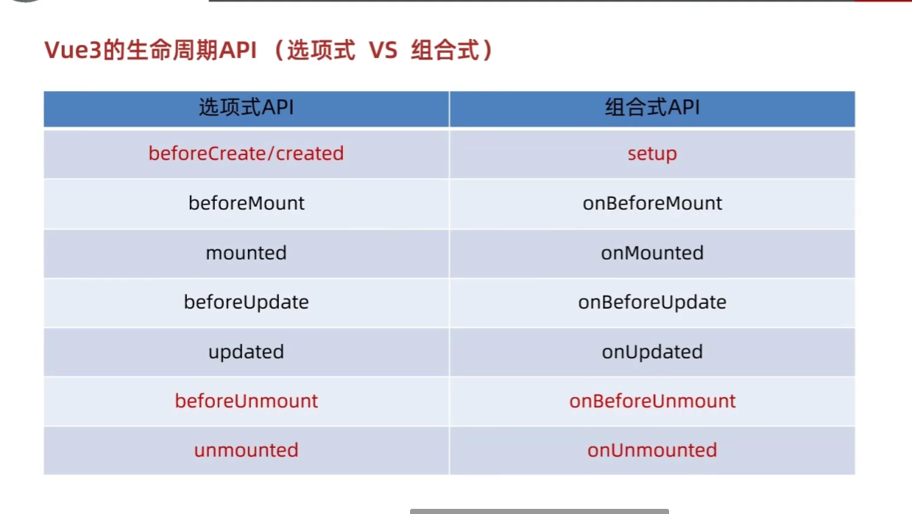

# vue3 创建
```js
npm init vue@latest
启动
npm run dev
```

```js
npm install -g pnpm
pnpm create vue

pnpm add [package]      # 添加依赖
pnpm add -D [package]   # 添加开发赖
pnpm remove [package]   # 移除依赖
pnpm update             # 更新依赖
```
# setup 语法糖
原始复杂写法
```js
<script>

export default {
  setup() {
    const msg = “1111111111111”
  
    return {
      msg
    }
  }
}
</script>


<template>
  <div class="container">
    <h1>{{ msg }}</h1>
  </div>
</template>

<style scoped>
</style>
```
语法糖
```js
<script setup>

const msg = "你好，世界"
</script>

<template>
  <div>
    <h1>{{msg}}</h1>
  </div>
</template>

<style scoped>
</style>
```
# reactive 和 ref
reactive 可以创建一个响应式对象，ref 可以创建一个响应式变量
```js
import {reactive} from 'vue'
const state = reactive({
  count:100
})
const add = () => {
  state.count++
}
```
ref 响应式变量
```js
import {ref} from 'vue'
const count = ref(100)
const add = () => {
  count.value++
}
注意点：
1. 脚本中访问数据，需要通过 .value
2. 在template中，.value 不需要加（帮我们扒了一层）
```
# computed 
```js
import {computed} from 'vue'
const count = ref(100)
const double = computed(() => {
  return count.value * 2
})
```
完整写法
```js
const count = ref(1)
const plusOne = computed({
  get: () => count.value + 1,
  set: (val) => {
    count.value = val - 1
  }
})
```
# watch
deep 深度监视，默认 watch 进行的是 浅层监视
const ref1 = ref (简单类型) 可以直接监视
const ref2 = ref (复杂类型) 监视不到复杂类型内部数据的变化

```js
import {watch} from 'vue'
const count = ref(100)
watch(count, (newVal, oldVal) => {
  console.log(newVal, oldVal)
})
```
watch 监听多个变量
```js
watch([count, count2], ([newVal, newVal2], [oldVal, oldVal2]) => {
  console.log(newVal, newVal2, oldVal, oldVal2)
})
```
watch 监听多个变量，并且开启深度监听
```js
watch([count, count2], ([newVal, newVal2], [oldVal, oldVal2]) => {
  console.log(newVal, newVal2, oldVal, oldVal2)
}, {deep: true})
```
精确监听对象的某个属性
```js
const info = ref({
  name: '张三',
  age: 18
})
watch(()=>info.value.age, (newVal, oldVal) => {
  console.log(newVal, oldVal)
})

```
监听对象 
```js
const info = ref({
  name: '张三',
  age: 18
})
watch(info, (newVal, oldVal) => {
  console.log(newVal, oldVal)
},{
  deep:true,
  immediate:true
})
```
# 生命周期函数

```js
onMounted(() => {
  console.log('onMounted')
})
onUpdated(() => {
  console.log('onUpdated')
})
onUnmounted(() => {
  console.log('onUnmounted')
})
```
# 组件通信
## 父组件向子组件传值
父
```js
<script setup>
import { ref } from 'vue'

import ZhiLi from '@/components/Zhi-Li.vue'
const s = ref(111)
</script>

<template>
  <div class="container">
    <ZhiLi :car='s'/>
  </div>
</template>

<style scoped>
</style>
```
子
```js
<script setup>
const props = defineProps({
  car: Number
})

</script>
<template>
   
       <div> {{ props.car }}</div>
</template>

<style scoped>

</style>

```
## 子组件向父组件传值
子
```js
<script setup>
const props = defineProps({
  car: Number
})
const emit = defineEmits(['change'])
const change = () => {
  emit('change', 100)
}
</script>
<template>
   
       <div> {{ props.car }}</div>
       <button @click='change'>改变</button>
</template>

<style scoped>

</style>
```
父
```js
<script setup>
import { ref } from 'vue'
// 或方案2：使用短横线命名导入（组件文件名为 Zhi-Li.vue）
import ZhiLi from '@/components/Zhi-Li.vue'
const s = ref(111)
const add = () => {
  s.value++
}
const sub = (ss) => {
  console.log(ss)
}
</script>

<template>
  <div class="container">
    <div></div>
    <ZhiLi :car='s' @change='sub' />
    <button @click='add'>按钮</button>
   
  </div>
</template>

<style scoped>

</style>
```
# 模板引用和 defineExpose 宏函数
```js
<script setup>
// 导入 ref 函数用于创建响应式引用
import { ref } from 'vue'

// 创建一个 ref 对象来引用 input 元素
// 初始值为 null，在组件挂载后会指向实际的 DOM 元素
const inp = ref(null)

// 定义一个方法用于聚焦输入框
// 通过访问 inp.value 可以获取到关联的 DOM 元素
const add = () => {
  inp.value.focus() // 调用 DOM 元素的 focus() 方法
}

// 使用 defineExpose 宏将方法暴露给父组件
// 父组件可以通过模板引用调用这些方法
defineExpose({
  add // 暴露 add 方法，父组件可以通过 $refs 访问
})
</script>

<template>
  <div class="container">
    <!-- 使用 ref="inp" 将 input 元素与上面定义的 inp ref 对象绑定 -->
    <input type="text" ref="inp" />
    <!-- 点击按钮时调用 add 方法聚焦输入框 -->
    <button @click="add">聚焦输入框</button>
  </div>
</template>
```
```js
要调用通过 defineExpose 暴露的 open 方法，需要先获取到子组件的实例引用（ref），然后通过该引用访问暴露的方法。以下是具体步骤：
1. 父组件中获取子组件引用
在父组件中使用子组件时，通过 ref 属性给子组件定义一个引用名，例如 childRef：

vue
<!-- 父组件 -->
<template>
  <!-- 给子组件添加 ref 属性 -->
  <ChildComponent ref="childRef" />
  <el-button @click="callChildOpen">调用子组件的open方法</el-button>
</template>

2. 在父组件中通过引用调用方法
在父组件的脚本中，通过 ref 实例访问子组件暴露的 open 方法：

vue
<script setup>
import { ref } from 'vue'
import ChildComponent from './ChildComponent.vue'

// 创建与子组件 ref 对应的变量（名称需与模板中一致）
const childRef = ref(null)

// 父组件中的方法，用于调用子组件的 open
const callChildOpen = () => {
  // 通过 ref 引用访问子组件暴露的 open 方法
  childRef.value.open()
}
</script>
```
# 跨层传递方法常用 provide/inject 
```js
1. 核心工具：provide & inject
作用：实现祖孙组件间的直接通信，避免多层 props 传递。
用法：
祖先组件：使用 provide(key, value) 提供数据或方法。
子孙组件：使用 inject(key) 获取数据或方法。
2. 示例代码
vue
<!-- 祖先组件 -->
<script setup>
import { ref, provide } from 'vue'
import Child from './Child.vue'

const count = ref(100)

// 提供响应式数据
provide('count', count)

// 提供修改数据的方法
provide('changeCount', (newCount) => {
  count.value = newCount
})
</script>

<template>
  <Child />
</template>

<!-- 子孙组件 -->
<script setup>
import { inject } from 'vue'

// 注入数据和方法
const count = inject('count')
const changeCount = inject('changeCount')

const add = () => {
  changeCount(1000) // 调用祖先组件的方法
}
</script>

<template>
  <div @click="add">{{ count }}</div>
</template>

响应式保持：
若传递 ref/reactive，子孙组件修改时，祖先组件数据会同步更新。
示例中 count 是响应式的，修改后模板会自动更新。
方法传递：
通过 provide 传递方法，可让子孙组件间接修改祖先数据。
示例中 changeCount 是一个修改 count 的方法。
```
# Vue3.3新特性 - defineOptions
```vue
所以在 Vue 3.3 中引入了 defineOptions 宏。顾名思义，
主要是用来定义 Options API 的选项。可以用 defineOptions 
定义任何选项，props, emits, expose, slots
 除外（因为这些可以使用 defineXXX 来做到）。
<script setup>
import { defineOptions } from 'vue';
defineOptions({
  name: 'Foo',
  inheritAttrs: false,
  // ... 更多自定义属性
})
</script>
```
# defineModel 双向绑定
```js
子
<script setup>
// 引入defineModel，用于实现组件间双向绑定
import { defineModel } from 'vue';
// 创建双向绑定变量ss，等价于接收父组件的modelValue props并自动处理update:modelValue事件
const ss = defineModel()

// 定义add方法，点击时触发
const add = () => {
  // 调用changeCount方法，但该方法未定义，会导致报错（问题点）
  changeCount(1000)
}
</script>
<template>
  <div class="child-card">
    <!-- 输入框与ss双向绑定，v-model语法错误，缺少引号（应为v-model="ss"） -->
    <input type="text" v-model = ss>
    <!-- 点击div触发add方法，展示count变量，但count未定义（问题点） -->
    <div @click = "add">{{ count }}</div>
  </div>
</template>

<style scoped>
/* scoped表示样式仅作用于当前组件 */
</style>
父------
<script setup>
// 引入defineOptions（当前代码未使用，可删除）
import { defineOptions } from 'vue';
// 引入子组件ZhiLi
import ZhiLi from './components/Zhi-Li.vue';

// 创建响应式变量arr，但未引入ref（问题点，会导致ref未定义报错）
const arr = ref('')
// 定义add方法，点击按钮时触发
const add = () => {
  // arr初始值为字符串，进行自增操作会得到NaN（逻辑问题）
  arr.value ++
}
</script>

<template>
  <div>
    <!-- 子组件使用v-model绑定arr，语法错误（应为v-model="arr"） -->
    <ZhiLi v-model = arr></ZhiLi>
    <!-- 展示arr的值，用于观察双向绑定效果 -->
    {{ arr }}
    <!-- 点击按钮触发父组件的add方法 -->
    <button @click = "add">添加</button>
  </div>
</template>

<style scoped>
/* scoped表示样式仅作用于当前组件 */
</style>

```
# Pinia
## 手动添加 Pinia 到 Vue 项目
```js
在控制面板 安装 pinia
npm install pinia
在main.js 配置代码
// 从pinia库中导入createPinia函数，用于创建Pinia实例
import { createPinia } from 'pinia'

// 创建一个Pinia实例，它是状态管理库的核心，用于存储和管理应用状态
const pinia = createPinia()

// 创建Vue应用实例，App是根组件
const app = createApp(App)

// 将Pinia实例通过use方法安装到Vue应用中，使整个应用可以使用Pinia进行状态管理
app.use(pinia)

// 将Vue应用挂载到DOM中id为app的元素上，启动应用
app.mount('#app')
```

## Pinia 的基本语法
```js
在src 下创建 store 文件夹
在store文件夹下创建一个文件 xxxx.js
import {defineStore} from 'pinia'
 // ref() 就是 state 属性
  // computed() 就是 getters
  // function() 就是 actions
// 定义一个Pinia仓库，第一个参数是仓库的唯一标识，第二个参数是一个函数，用于定义仓库的状态、计算属性和操作
export const useCounterStore = defineStore('counter',()=> {
  // 定义一个响应式状态属性，初始值为0
  const count = ref(0)

  // 定义一个计算属性，根据状态属性计算出一个新的值
  const double = computed(() => count.value * 2)

  // 定义一个操作方法，用于修改状态属性
   const add = () => {
    count.value++
  }
  return {
    count,
    double,
    add
  }
}
```
调用
```js
import {useCounterStore} from './store/counter.js'
const counterStore = useCounterStore()
在html
<template>
  <div>
    {{ counterStore.count }}
    {{ counterStore.msg }}
    <button @click="counterStore.add">++</button>
    <son1Com />
    <son2Com />
  </div>
</template>
```
## action 异步操作
```js
在src 下创建 store 文件夹
在store文件夹下创建一个文件 xxxx.js
import {defineStore} from 'pinia'
import {ref} from 'vue'
export const useChannelStore = defineStore('channel',()=>{
    const channeList = ref([])
  声明操作数据的方法
  const getList = async () => {
    // 支持异步
    const { data: { data } } = await axios.get('http://geek.itheima.net/v1_0/channels')
    channeList.value = data.channels
    console.log(data.channels)
  }
  声明getters相关
  return {
    channeList,
    getList
  }
})
调用同上

```
## storeToRefs
```js
如果要使用{}
如果是函数就直接使用
import {useCounterStore} from './store/counter.js'
const counterStore = useCounterStore()
const {sum} = counterStore
如果是变量
const {sum} = storeToRefs(counterStore)
```
## 本地持久化
```js
https://prazdevs.github.io/pinia-plugin-persistedstate/zh/guide/
```
## store 封装
```js
在src 下创建 store 文件夹
创建一个modules文件夹
在modules文件夹下创建一个文件 xxxx.js
import {defineStore} from 'pinia'
import {ref} from 'vue'

export const useUserStore = defineStore('user',()=>{
  const token = ref('')
  return {
    token
  }
},{
  persist:true;
})
```
```js
在src 下创建 store 文件夹
在store文件夹下创建一个文件 index.js
import {createPinia} from 'pinia'
import piniaPluginPersistedstate from 'pinia-plugin-persistedstate'// 
const pinia = createPinia()
pinia.use(piniaPluginPersistedstate)
export default pinia
将modules文件夹下的文件引入
export * from './modules/xxxx.js'
```
```js
在main.js 中引入
import pinia from './store'
app.use(pinia)
```
```js
使用
import {useUserStore} from '@/store'
// 这里的路进导入'@/store' 是因为在main.js 中引入了pinia
const userStore = useUserStore()
userStore.token
```
# utils
## request.js 的封装
```js
import axios from 'axios'
import {useUserStore} from '@/store'
import router from '@/router'
1.创建一个实例
const baseURL = 'http://big-event-vue-api-t.itheima.net'

const instance = axios.create({
  // TODO 1. 基础地址，超时时间
  baseURL,
  timeout: 10000
})

2.添加请求拦截器
instance.interceptors.request.use(
  (config) => {
    // TODO 2. 携带token
    const useStore = useUserStore()
    if (useStore.token) {
      config.headers.Authorization = useStore.token
    }
    return config
  },
  (err) => Promise.reject(err)
)

3.添加响应拦截器
instance.interceptors.response.use(
  (res) => {
    // TODO 4. 摘取核心响应数据
    if (res.data.code === 0) {
      return res
    }
    // TODO 3. 处理业务失败
    // 处理业务失败, 给错误提示，抛出错误
    ElMessage.error(res.data.message || '服务异常')
    return Promise.reject(res.data)
  },
  (err) => {
    // TODO 5. 处理401错误
    // 错误的特殊情况 => 401 权限不足 或 token 过期 => 拦截到登录
    if (err.response?.status === 401) {
      router.push('/login')
    }

    // 错误的默认情况 => 只要给提示
    ElMessage.error(err.response.data.message || '服务异常')
    return Promise.reject(err)
  }
)

4.导出实例
export default instance
export { baseURL }
```
# router 的封装
```JS
import { createRouter, createWebHistory } from 'vue-router'

const router = createRouter({
  history: createWebHistory(import.meta.env.BASE_URL),
  routes: [
    { path: '/login', component: () => import('@/views/login/LoginPage.vue') },
    {
      path: '/', component: () => import('@/views/layout/LayoutContainer.vue'),
      // redirect: '/article/manage',
      redirect: '/login',
      children: [
        { path: '/article/manage', component: () => import('@/views/article/ArticleManage.vue') },
        { path: '/article/channel', component: () => import('@/views/article/ArticleChannel.vue') },
        { path: '/user/avatar', component: () => import('@/views/user/UserAvatar.vue') },
        { path: '/user/password', component: () => import('@/views/user/UserPassword.vue') },
        { path: '/user/profile', component: () => import('@/views/user/UserProfile.vue') },
      ]

    }

  ],
})

export default router
```
# 登录/注册
## 布局
```js
layout:https://element-plus.org/zh-CN/component/layout.html
<el-row> el-row表示一行，一行分成24份
    <el-col :span="12"> 这是占据 12 份宽度的列内容
    </el-col>
    <el-col :span="12" :offset="3">
    </el-col>
    {/* (1) :span="12" 代表在一行中，占12份（50%）
(2) :span="6" 表示在一行中，占6份 （25%）
(3) :offset="3" 代表在一行中，左侧margin份数 */}
</el-row>
```
## 登录 from 表单校验
```js
from 表单校验:https://element-plus.org/zh-CN/component/form.html
 <el-form size="large" class="form" :model="formModel" :rules="rules" autocomplete="off"
        ref="form">
</el-form>
(1) el-form => :model="ruleForm" 绑定的整个 form 的数据对象 { xxx, xxx, xxx }  
(2) el-form => :rules="rules" 绑定的整个 rules 规则对象 { xxx, xxx, xxx }  
(3) el-input => v-model="ruleForm.xxx" 给表单元素，绑定 form 的子属性  
(4) el-form-item => prop 配置生效的是哪个校验规则（和 rules 中的字段要对应）  
:model="ruleForm" 的使用
const ruleForm = ref({
  username: '',
  password: '',
  repassword:''
})
:rules="rules" 的使用
// rules 用来校验的对象// 1. 非空校验 required: true message消息提示，trigger触发校验的时机 blur change
// 长度校验 min max message消息提示，trigger触发校验的时机 blur change
// 3. 正则校验 pattern: 正则规则  \S 非空字符
4.  validator 自定义校验 
const rules = {
  repassword: [
    { required: true, message: '请输入密码', trigger: 'blur' },
    { pattern: /^.{6,15}$/, message: '密码必须是 6 - 15位 的非空字符', trigger: 'blur' },
    {
      validator: (rule, value, callback) => {
        // 注释：判断 value 和当前 form 中收集的 password 是否一致等逻辑（原代码有相关注释示意）
        // 实际完整逻辑需结合 form 数据判断，比如对比 ruleForm.password
        // if (value!== ruleForm.password) { 
        //   callback(new Error('两次输入密码不一致'));
        // } else {
        //   callback();
        // }
      }
    }
  ] username: [
    { required: true, message: '请输入用户名', trigger: 'blur' },
    { min: 5, max: 10, message: '用户名必须是 5 - 10位 的字符', trigger: 'blur' }
  ],

}


5. 怎么去使用 validator
先给 form 绑定 ref
import { ref } from 'vue'
const form = ref(null)

<el-form size="large" class="form" :model="formModel" :rules="rules" autocomplete="off"
        ref="form">
const register = async () => {
  await form.value.validate()
}
在注册按钮点击事件中调用 register 方法
@click = "register"
```
## 实现注册校验

【需求】注册页面基本校验

1. 用户名非空，长度校验5-10位
2. 密码非空，长度校验6-15位
3. 再次输入密码，非空，长度校验6-15位

【进阶】再次输入密码需要自定义校验规则，和密码框值一致（可选）

注意：

1. model 属性绑定 form 数据对象

```jsx
const formModel = ref({
  username: '',
  password: '',
  repassword: ''
})

<el-form :model="formModel" >
```

2. v-model 绑定 form 数据对象的子属性

```jsx
<el-input
  v-model="formModel.username"
  :prefix-icon="User"
  placeholder="请输入用户名"
></el-input>
... 
(其他两个也要绑定)
```

3. rules 配置校验规则

```jsx
<el-form :rules="rules" >
    
const rules = {
  username: [
    { required: true, message: '请输入用户名', trigger: 'blur' },
    { min: 5, max: 10, message: '用户名必须是5-10位的字符', trigger: 'blur' }
  ],
  password: [
    { required: true, message: '请输入密码', trigger: 'blur' },
    {
      pattern: /^\S{6,15}$/,
      message: '密码必须是6-15位的非空字符',
      trigger: 'blur'
    }
  ],
  repassword: [
    { required: true, message: '请再次输入密码', trigger: 'blur' },
    {
      pattern: /^\S{6,15}$/,
      message: '密码必须是6-15的非空字符',
      trigger: 'blur'
    },
    {
      validator: (rule, value, callback) => {
        if (value !== formModel.value.password) {
          callback(new Error('两次输入密码不一致!'))
        } else {
          callback()
        }
      },
      trigger: 'blur'
    }
  ]
}
```

4. prop 绑定校验规则

```jsx
<el-form-item prop="username">
  <el-input
    v-model="formModel.username"
    :prefix-icon="User"
    placeholder="请输入用户名"
  ></el-input>
</el-form-item>
... 
(其他两个也要绑定prop)
```


## 注册前的预校验

需求：点击注册按钮，注册之前，需要先校验

1. 通过 ref 获取到 表单组件

```jsx
const form = ref()

<el-form ref="form">
```

2. 注册之前进行校验

```jsx
<el-button
  @click="register"
  class="button"
  type="primary"
  auto-insert-space
>
  注册
</el-button>

const register = async () => {
  await form.value.validate()
  console.log('开始注册请求')
}
```
# 首页 layout 架子 [element-plus 菜单]
## 基本架子拆解
```js
Container 布局容器:https://element-plus.org/zh-CN/component/container.html#container-%E5%B8%83%E5%B1%80%E5%AE%B9%E5%99%A8
```
**架子组件列表：**

el-container

- el-aside 左侧
  - el-menu 左侧边栏菜单

- el-container  右侧
  - el-header  右侧头部
    - el-dropdown
  - el-main  右侧主体
    - router-view
```js
<script setup>
import {
  Management,
  Promotion,
  UserFilled,
  User,
  Crop,
  EditPen,
  SwitchButton,
  CaretBottom
} from '@element-plus/icons-vue'
import avatar from '@/assets/default.png'
</script>

<template>
  <el-container class="layout-container">
    <el-aside width="200px">
     <!-- 侧边栏logo区域 -->
<!-- 通常用于放置网站或系统的logo图片，通过class="el-aside__logo"设置样式 -->
<div class="el-aside__logo"></div>

<!-- 侧边栏菜单组件 -->
<!-- el-menu是Element Plus提供的菜单组件，用于创建导航菜单 -->
<el-menu
  active-text-color="#ffd04b"  <!-- 当前激活菜单的文字颜色 -->
  background-color="#232323"   <!-- 菜单的背景颜色 -->
  :default-active="$route.path" <!-- 绑定当前激活的菜单路径，与路由同步 -->
  text-color="#fff"            <!-- 菜单默认的文字颜色 -->
  router                       <!-- 启用路由模式，点击菜单会触发路由跳转 -->
>
  <!-- 具体的菜单项 -->
  <!-- el-menu-item表示一个菜单项，index属性对应路由路径 -->
  <el-menu-item index="/article/channel">
    <!-- 菜单图标 -->
    <!-- el-icon是Element Plus的图标容器，内部放置具体图标组件 -->
    <el-icon><Management /></el-icon>
    <!-- 菜单文字 -->
    <span>文章分类</span>
  </el-menu-item>
</el-menu>
        <el-menu-item index="/article/manage">
          <el-icon><Promotion /></el-icon>
          <span>文章管理</span>
        </el-menu-item>
        <el-sub-menu index="/user">
          <template #title>
            <el-icon><UserFilled /></el-icon>
            <span>个人中心</span>
          </template>
          <el-menu-item index="/user/profile">
            <el-icon><User /></el-icon>
            <span>基本资料</span>
          </el-menu-item>
          <el-menu-item index="/user/avatar">
            <el-icon><Crop /></el-icon>
            <span>更换头像</span>
          </el-menu-item>
          <el-menu-item index="/user/password">
            <el-icon><EditPen /></el-icon>
            <span>重置密码</span>
          </el-menu-item>
        </el-sub-menu>
      </el-menu>
    </el-aside>
    <el-container>
      <el-header>
        <div>黑马程序员：<strong>小帅鹏</strong></div>
        <el-dropdown placement="bottom-end">
          <span class="el-dropdown__box">
            <el-avatar :src="avatar" />
            <el-icon><CaretBottom /></el-icon>
          </span>
          <template #dropdown>
            <el-dropdown-menu>
              <el-dropdown-item command="profile" :icon="User"
                >基本资料</el-dropdown-item
              >
              <el-dropdown-item command="avatar" :icon="Crop"
                >更换头像</el-dropdown-item
              >
              <el-dropdown-item command="password" :icon="EditPen"
                >重置密码</el-dropdown-item
              >
              <el-dropdown-item command="logout" :icon="SwitchButton"
                >退出登录</el-dropdown-item
              >
            </el-dropdown-menu>
          </template>
        </el-dropdown>
      </el-header>
      <el-main>
        <router-view></router-view>
      </el-main>
      <el-footer>大事件 ©2023 Created by 黑马程序员</el-footer>
    </el-container>
  </el-container>
</template>

<style lang="scss" scoped>
.layout-container {
  height: 100vh;
  .el-aside {
    background-color: #232323;
    &__logo {
      height: 120px;
      background: url('@/assets/logo.png') no-repeat center / 120px auto;
    }
    .el-menu {
      border-right: none;
    }
  }
  .el-header {
    background-color: #fff;
    display: flex;
    align-items: center;
    justify-content: space-between;
    .el-dropdown__box {
      display: flex;
      align-items: center;
      .el-icon {
        color: #999;
        margin-left: 10px;
      }

      &:active,
      &:focus {
        outline: none;
      }
    }
  }
  .el-footer {
    display: flex;
    align-items: center;
    justify-content: center;
    font-size: 14px;
    color: #666;
  }
}
</style>
```
```js
<template>
  <div class="common-layout">
    <el-container>
      <el-aside width="200px">Aside</el-aside>
      <el-container>
        <el-header>Header</el-header>
        <el-main>Main</el-main>
        <el-footer>Footer</el-footer>
      </el-container>
    </el-container>
  </div>
</template>
```
## 登录访问拦截

需求：只有登录页，可以未授权的时候访问，其他所有页面，都需要先登录再访问
```js
https://v3.router.vuejs.org/zh/guide/advanced/navigation-guards.html#%E8%B7%AF%E7%94%B1%E7%8B%AC%E4%BA%AB%E7%9A%84%E5%AE%88%E5%8D%AB
```
```js
在router 中配置
index.js
// 登录访问拦截
router.beforeEach((to) => {
  const userStore = useUserStore()
  if (!userStore.token && to.path !== '/login') return '/login'
})
```

## 用户基本信息获取&渲染
1. `api/user.js`封装接口

```jsx
export const userGetInfoService = () => request.get('/my/userinfo')
```

2. stores/modules/user.js 定义数据

```jsx
const user = ref({})
const getUser = async () => {
  const res = await userGetInfoService() // 请求获取数据
  user.value = res.data.data
}
```

3. `layout/LayoutContainer`页面中调用

```js
import { useUserStore } from '@/stores'
const userStore = useUserStore()
onMounted(() => {
  userStore.getUser()
})
```

4. 动态渲染

```jsx
<div>
  黑马程序员：<strong>{{ userStore.user.nickname || userStore.user.username }}</strong>
</div>

<el-avatar :src="userStore.user.user_pic || avatar" />
```

## 退出功能 [element-plus 确认框]

1. 注册点击事件

```jsx
<el-dropdown placement="bottom-end" @command="onCommand">

<el-dropdown-menu>
  <el-dropdown-item command="profile" :icon="User">基本资料</el-dropdown-item>
  <el-dropdown-item command="avatar" :icon="Crop">更换头像</el-dropdown-item>
  <el-dropdown-item command="password" :icon="EditPen">重置密码</el-dropdown-item>
  <el-dropdown-item command="logout" :icon="SwitchButton">退出登录</el-dropdown-item>
</el-dropdown-menu>
```

2. 添加退出功能

```jsx
const onCommand = async (command) => {
  if (command === 'logout') {
    await ElMessageBox.confirm('你确认退出大事件吗？', '温馨提示', {
      type: 'warning',
      confirmButtonText: '确认',
      cancelButtonText: '取消'
    })
    userStore.removeToken()
    userStore.setUser({})
    router.push(`/login`)
  } else {
    router.push(`/user/${command}`)
  }
}
```

3. pinia  user.js 模块 提供 setUser 方法

```jsx
const setUser = (obj) => (user.value = obj)
```
