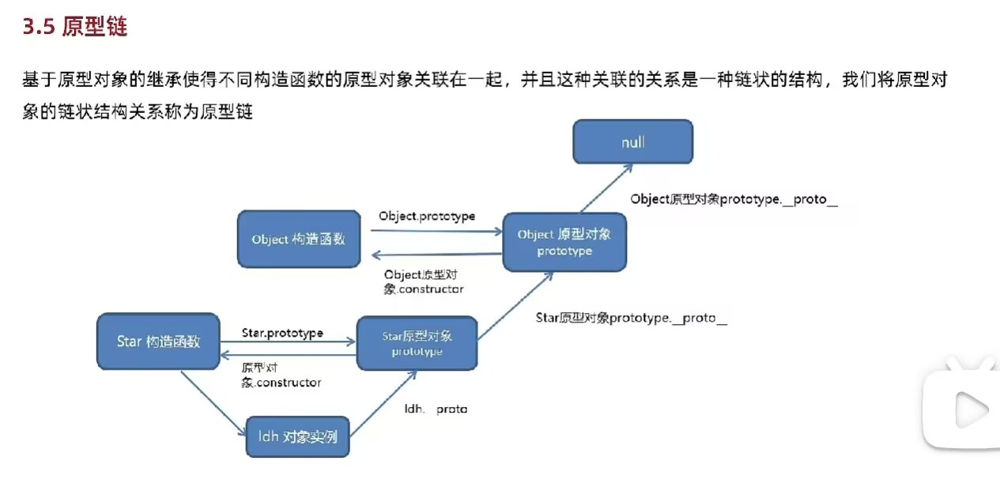

# JavaScript中的数据类型？存储上的差别？
## 基本数据类型
### 基本类型
```js
Number String Boolean null undefinded Symbol
```
### Number

整数
```js
let a = 100 10进制
let a = 0b100 2进制
let a = 0o100 8进制
let a = 0x100 16进制
```
浮点数
```js
let a = 10.10 
```
在数值类型，有一个特殊的数值：NaN
NaN 不是数值，用于表示本来要返回数值的操作失败了（而不是抛出错误）
```js
console.log(0/0); // NaN
console.log(-0/+0); // NaN
```
### Undefined
underfined 类型只有一个值，即特殊的 undefined。
当var let声明的变量还未被初始化时，变量的默认值为 undefined。
```js
let a; // undefined
console.log(a === undefined); // undefined
```
包含undefined 值的变量跟未定义变量是有区别的
```js
let message; // 这个变量被声明了，只是值为 undefined
console.log(message); // "undefined"
console.log(age); // 没有声明过这个变量，报错
```
### String
字符串可以使用单引号或双引号表示
```js
let a = 'abc' // 单引号
let a = "abc" // 双引号
let a = `abc` // 反引号
```
字符串不可以改变，一旦创建，就不能改变
```js
let a = 'abc'
a[0] = 'b' // 报错
```
### Null
null 类型只有一个值，即特殊的 null。
null 被认为是一个空对象引用，所以 typeof null 会返回 "object"。
```js
let a = null // null
console.log(typeof a); // "object"
```
underfined 是值由null值派生而来，所以它们的相等性测试将返回 true。
```js
let a = null // null
let b = undefined // undefined
console.log(a === b); // true
```
### Boolean
布尔值有两个：true 和 false。
布尔值通常用于条件判断。
```js
数据类型  转换true 的值
Boolean    true
Number     任何非零数字值（包括无穷大）
String     任何非空字符串
Object     任何对象
```
### Symbol
Symbol 是一种新的原始数据类型，它是不可变的，可以用作对象的属性。
Symbol 是唯一的，不能通过 new 关键字创建。

## 引用类型
复杂类型叫object类型,我们主讲三种
```js
Object Array Function
```
### Object
对象是一组无序的属性的集合。
对象的属性可以是任何类型的值，包括函数。
```js
let person = {
    name: "Nicholas",
    "age": 29,
    5: true
};
```
### Array
数组是一组有序的值。
数组的元素可以是任何类型的值，包括对象。
```js
let colors = ["red", 2, {age: 20 }]
colors.push(2)
```
### Function
函数是一段可执行的代码块。
函数可以接受参数，也可以返回值。

声明式
```js
function add(a, b) {
    return a + b;
}
```
表达式
```js
let sum = function(num1, num2) {
    return num1 + num2;
};
```
箭头函数
```js
let sum = (num1, num2) => {
    return num1 + num2;
};
```
## 存储区别
基本数据类型存储在栈中
引用类型的对象存储于堆中
```js
let a = 100 // 基本数据类型
let b = {name: 'zhangsan'} // 引用类型
```
# 数组的常用方法有哪些？
## 一.操作方法
数组基本操作可以归纳为 增、删、改、查，需要留意的是哪些方法会对原数组产生影响，哪些方法不会
下面对数组常用的操作方法做一个归纳

### 增
```js
push()
unshift()
splice()
concat()// 不会改变原数组
```
push() 
方法将一个或多个元素添加到数组的末尾，并返回该数组的新长度。
```js
let arr = [1, 2, 3]
arr.push(4) // [1, 2, 3, 4]
```
unshift()
方法将一个或多个元素添加到数组的开头，并返回该数组的新长度。
```js
let arr = [1, 2, 3]
arr.unshift(4) // [4, 1, 2, 3]
```
splice()
方法通过删除或替换现有元素或者原地添加新的元素来修改数组,并以数组形式返回被修改的内容。
```js
let arr = [1, 2, 3]
arr.splice(1, 0, 4,8) // [1, 4, 8, 2, 3]
```
concat()
方法用于合并两个或多个数组。此方法不会更改现有数组，而是返回一个新数组。
```js
let arr = [1, 2, 3]
let arr2 = [4, 5, 6]
arr.concat(arr2) // [1, 2, 3, 4, 5, 6]
```
### 删
```js
pop()
shift()
splice()
slice()// 不会改变原数组
```
pop()
方法从数组中删除最后一个元素，并返回该元素的值。此方法更改数组的长度。
```js
let arr = [1, 2, 3]
arr.pop() // [1, 2]
```
shift()
方法从数组中删除第一个元素，并返回该元素的值。此方法更改数组的长度。
```js
let arr = [1, 2, 3]
arr.shift() // [2, 3]
```
splice()
方法通过删除或替换现有元素或者原地添加新的元素来修改数组,并以数组形式返回被修改的内容。
```js
let arr = [1, 2, 3]
arr.splice(1, 1) // [1, 3]
```
slice()
方法返回一个新的数组对象，这一对象是一个由 begin 和 end 决定的原数组的浅拷贝（包括 begin，不包括end）。原始数组不会被改变。
```js
let arr = [1, 2, 3]
arr.slice(1, 2) // [2]
```
### 改
```js
splice()
```
splice()
方法通过删除或替换现有元素或者原地添加新的元素来修改数组,并以数组形式返回被修改的内容。
```js
let arr = [1, 2, 3]
arr.splice(1, 2, 4,1) // [1, 4, 1]
```
### 查
```js
indexOf()
includes()
find()
```
indexOf()
方法返回在数组中可以找到一个给定元素的第一个索引，如果不存在，则返回-1。
```js
let arr = [1, 2, 3]
arr.indexOf(2) // 1
```
includes()
方法用来判断一个数组是否包含一个指定的值，根据情况，如果包含则返回 true，否则返回false。
```js
let arr = [1, 2, 3]
arr.includes(2) // true
```
find()
方法返回数组中满足提供的测试函数的第一个元素的值。否则返回 undefined。
```js
let arr = [1, 2, 3]
arr.find(item => item > 1) // 2
```
## 排序方法
```js
sort()
reverse()
```
sort()
方法用原地算法对数组的元素进行排序，并返回数组。默认排序顺序是在将元素转换为字符串，然后比较它们的UTF-16代码单元值序列时构建的
```js
let arr = [1, 2, 3,1,0]
arr.sort() // [0, 1, 1, 2, 3]
```
reverse()
方法将数组中元素的位置颠倒，并返回该数组。数组的第一个元素会变成最后一个，数组的最后一个元素变成第一个。该方法会改变原数组。
```js
let arr = [1, 2, 3]
arr.reverse() // [3, 2, 1]
```
## 转换方法
```js
join()
```
join()
方法将一个数组（或一个类数组对象）的所有元素连接成一个字符串并返回这个字符串。如果数组只有一个项目，那么将返回该项目而不使用分隔符。
```js
let arr = [1, 2, 3]
arr.join() // "1,2,3"
```
## 迭代方法
```js
forEach()
map()
filter()
reduce()
every()
some()
```
forEach()
方法对数组的每个元素执行一次给定的函数。
```js
let arr = [1, 2, 3]
arr.forEach(item => console.log(item)) // 1 2 3
```
map()
方法创建一个新数组，这个新数组由原数组中的每个元素都调用一次提供的函数后的返回值组成。
```js   
let arr = [1, 2, 3]
arr.map(item => item * 2) // [2, 4, 6]
```
filter()
方法创建一个新数组, 其包含通过所提供函数实现的测试的所有元素。
```js
let arr = [1, 2, 3]
arr.filter(item => item > 1) // [2, 3]
```
reduce()
方法对数组中的每个元素执行一个由您提供的reducer函数(升序执行)，将其结果汇总为单个返回值。
```js
let arr = [1, 2, 3]
arr.reduce((acc, cur) => acc + cur, 0) // 6
```
every()
```js
let arr = [1, 2, 3]
arr.every(item => item > 1) // false
```
some()
```js
let arr = [1, 2, 3]
arr.some(item => item > 1) // true
```
# JavaScript字符串的常用方法有哪些？
## 一.操作方法
字符串基本操作可以归纳为 增、删、改、查，需要留意的是哪些方法会对原字符串产生影响，哪些方法不会
### 增
这里增的意思并不是说直接增添内容，而是创建字符串的一个副本，再进行操作
除了常用+以及${}进行字符串拼接之外，还可通过concat

concat
```js
let stringValue = "hello ";
let result = stringValue.concat("world");
console.log(result); // "hello world"
console.log(stringValue); // "hello"
```
### 删
这里删的意思并不是说直接删除内容，而是创建字符串的一个副本，再进行操作
slice()
substr()
substring()
```js
let stringValue = "hello world";
console.log(stringValue.slice(3)); // "lo world"
console.log(stringValue.substring(3)); // "lo world"
console.log(stringValue.substr(3)); // "lo world"
console.log(stringValue.slice(3, 7)); // "lo w"
console.log(stringValue.substring(3,7)); // "lo w"
console.log(stringValue.substr(3, 7)); // "lo worl"
```
# 谈谈 JavaScript 中的类型转换机制
## 强制转换（显示转换）
强制转换是指使用特定的函数或方法将一个值转换为另一个类型。
显示转换，即我们很清楚可以看到这里发生了类型的转变，常见的方法有：
Number()
parseInt()
String()
Boolean()

#Number()
将任意类型的值转化为数值
先给出类型转换规则：
```js
Number(324) // 324

// 字符串：如果可以被解析为数值，则转换为相应的数值
Number('324') // 324

// 字符串：如果不可以被解析为数值，返回 NaN
Number('324abc') // NaN

// 空字符串转为0
Number('') // 0

// 布尔值：true 转成 1，false 转成 0
Number(true) // 1
Number(false) // 0

// undefined：转成 NaN
Number(undefined) // NaN

// null：转成0
Number(null) // 0

// 对象：通常转换成NaN(除了只包含单个数值的数组)
Number({a: 1}) // NaN
Number([1, 2, 3]) // NaN
Number([5]) // 5
```
从上面可以看到，Number转换的时候是很严格的，只要有一个字符无法转成数值，整个字符串就会被转为NaN

parseInt()
parseInt相比Number，就没那么严格了，parseInt函数逐个解析字符，遇到不能转换的字符就停下来
```js
parseInt('32a3') //32
```

String()
可以将任意类型的值转化成字符串
```js
// 数值：转为相应的字符串
String(1) // "1"
//字符串：转换后还是原来的值
String("a") // "a"
//布尔值：true转为字符串"true"，false转为字符串"false"
String(true) // "true"
//undefined：转为字符串"undefined"
String(undefined) // "undefined"
//null：转为字符串"null"
String(null) // "null"
//对象
String({a: 1}) // "[object Object]"
String([1, 2, 3]) // "1,2,3"
```
Boolean()
可以将任意类型的值转为布尔值，转换规则如下
```js
Boolean(undefined) // false
Boolean(null) // false
Boolean(0) // false
Boolean(NaN) // false
Boolean('') // false
Boolean({}) // true
Boolean([]) // true
Boolean(new Boolean(false)) // true
```
## 隐式转换
隐式转换是指在代码执行过程中，由 JavaScript 引擎自动进行的类型转换。
隐式转换通常发生在不同类型的值之间进行操作时，例如：
比较运算（==、!=、>、<）、if、while需要布尔值地方
算术运算（+、-、*、/、%）
自动转换成字符串
遇到预期为字符串的地方，就会将非字符串的值自动转为字符串

具体规则是：先将复合类型的值转为原始类型的值，再将原始类型的值转为字符串

常发生在+运算中，一旦存在字符串，则会进行字符串拼接操作
```js
'5' + 1 // '51'
'5' + true // "5true"
'5' + false // "5false"
'5' + {} // "5[object Object]"
'5' + [] // "5"
'5' + function (){} // "5function (){}"
'5' + undefined // "5undefined"
'5' + null // "5null"
```
自动转换成数值
除了+有可能把运算子转为字符串，其他运算符都会把运算子自动转成数值
```js
'5' - '2' // 3
'5' * '2' // 10
true - 1  // 0
false - 1 // -1
'1' - 1   // 0
'5' * []    // 0
false / '5' // 0
'abc' - 1   // NaN
null + 1 // 1
undefined + 1 // NaN
```

# == 和 ===区别，分别在什么情况使用
## ==（等于操作符）
如果两个操作数是不同类型，那么在比较相等性之前，会发生类型转换。
如果两个操作数是同一类型，那么直接比较它们的值。
```js
let result1 = (null == undefined ); // true
let result1 = (NaN == NaN ); // false
```
## ===（全等操作符）
全等操作符由 3 个等于号（ === ）表示，只有两个操作数在不转换的前提下相等才返回 true。即类型相同，值也需相同
```js
let result1 = ("55" === 55); // false，不相等，因为数据类型不同
let result2 = (55 === 55); // true，相等，因为数据类型相同值也相同
```
## 区别
相等操作符（==）会做类型转换，再进行值的比较，全等运算符不会做类型转换
```js
let result1 = ("55" === 55); // false，不相等，因为数据类型不同
let result2 = (55 === 55); // true，相等，因为数据类型相同值也相同
```
null 和 undefined 比较，相等操作符（==）为true，全等为false
```js
let result1 = (null == undefined ); // true
let result2 = (null  === undefined); // false
```
# 深拷贝浅拷贝的区别？如何实现一个深拷贝？
## 数据类型储存
前面文章我们讲到，JavaScript中存在两大数据类型：
基本类型
引用类型
基本类型数据保存在在栈内存中
引用类型数据保存在堆内存中，引用数据类型的变量是一个指向堆内存中实际对象的引用，存在栈中
## 浅拷贝
浅拷贝是指创建一个新对象，这个对象有着原始对象属性值的一份精确拷贝。
如果属性是基本类型，拷贝的就是基本类型的值；
如果属性是引用类型，拷贝的就是内存地址 ，所以如果其中一个对象改变了这个地址，就会影响到另一个对象。
即浅拷贝是拷贝一层，深层次的引用类型则共享内存地址
```js
function shallowClone(obj) {
    const newObj = {};
    for(let prop in obj) {
        if(obj.hasOwnProperty(prop)){
            newObj[prop] = obj[prop];
        }
    }
    return newObj;
}
```
浅拷贝的实现方式与案例
Object.assign()
```js
// 原对象
const original = {
  name: "张三",
  age: 25,
  info: { city: "北京" },
  hobbies: ["阅读", "编程"]
};

// 浅拷贝
const shallowCopy = Object.assign({}, original);

// 修改新对象的基本类型属性（独立）
shallowCopy.name = "李四";
console.log(original.name); // 输出：张三（原对象不受影响）

// 修改新对象的引用类型属性（共享内存）
shallowCopy.info.city = "上海";
console.log(original.info.city); // 输出：上海（原对象被修改）
shallowCopy.hobbies.push("音乐");
console.log(original.hobbies); // 输出：["阅读", "编程", "音乐"]（原数组被修改）
```
slice()
```js
const fxArr = ["One", "Two", "Three"]
const fxArrs = fxArr.slice(0)
fxArrs[1] = "love";
console.log(fxArr) // ["One", "Two", "Three"]
console.log(fxArrs) // ["One", "love", "Three"]
```
concat()
```js
const fxArr = ["One", "Two", "Three"]
const fxArrs = fxArr.concat()
fxArrs[1] = "love";
console.log(fxArr) // ["One", "Two", "Three"]
console.log(fxArrs) // ["One", "love", "Three"]
```
拓展运算符
```js
const fxArr = ["One", "Two", "Three"]
const fxArrs = [...fxArr]
fxArrs[1] = "love";
console.log(fxArr) // ["One", "Two", "Three"]
console.log(fxArrs) //  ["One", "love", "Three"]
```
## 深拷贝
开辟一个新的站，两个对象属性相同（但是完全独立），但是对应两个不同的地址，修改一个对象的属性，不会改变另一个对象的属性。
常见的深拷贝方式
_.cloneDeep()
jQuery.extend()
JSON.stringify()
手写循环递归

_.cloneDeep()
```js
const _ = require('lodash');// 是在 Node.js 环境 中引入 Lodash 库 的标准写法
const obj1 = {
    a: 1,
    b: { f: { g: 1 } },
    c: [1, 2, 3]
};
const obj2 = _.cloneDeep(obj1);
console.log(obj1.b.f === obj2.b.f);// false
```
JSON.stringify()
```js
const obj2=JSON.parse(JSON.stringify(obj1));
```
## 区别
浅拷贝只复制属性指向某个对象的指针，而不复制对象本身，新旧对象还是共享同一块内存，修改对象属性会影响原对象
深拷贝会另外创造一个一模一样的对象，新对象跟原对象不共享内存，修改新对象不会改到原对象

# 说说你对闭包的理解？闭包使用场景
## 是什么
一个函数和对其周围状态（词法环境）的引用捆绑在一起（或者说函数被引用包围），这样的组合就是闭包。
也就是说，闭包让你可以在一个内层函数中访问到其外层函数的作用域。
在 JavaScript 中，每当创建一个函数，闭包就会在函数创建的同时被创建出来。
```js
function init() {
    var name = "Mozilla"; // name 是一个被 init 创建的局部变量
    function displayName() { // displayName() 是内部函数，一个闭包
        alert(name); // 使用了父函数中声明的变量
    }
    displayName();
}
init();
```
displayName() 没有自己的局部变量。然而，由于闭包的特性，它可以访问到外部函
## 使用场景
任何闭包的使用场景都离不开这两点：
创建私有变量
延长变量的生命周期
例如计数器、延迟调用、回调等闭包的应用，其核心思想还是创建私有变量和延长变量的生命周期
在页面上添加一些可以调整字号的按钮
```js
function makeSizer(size) {
    return function() {
        document.body.style.fontSize = size + 'px';
    };
}
var size12 = makeSizer(12);
var size14 = makeSizer(14);
var size16 = makeSizer(16);
```
柯里化函数
柯里化的目的在于避免频繁调用具有相同参数函数的同时，又能够轻松的重用
```js
// 假设我们有一个求长方形面积的函数
function getArea(width, height) {
    return width * height
}
// 如果我们碰到的长方形的宽老是10
const area1 = getArea(10, 20)
const area2 = getArea(10, 30)
const area3 = getArea(10, 40)

// 我们可以使用闭包柯里化这个计算面积的函数
function getArea(width) {
    return height => {
        return width * height
    }
}

const getTenWidthArea = getArea(10)
// 之后碰到宽度为10的长方形就可以这样计算面积
const area1 = getTenWidthArea(20)

// 而且如果遇到宽度偶尔变化也可以轻松复用
const getTwentyWidthArea = getArea(20)
```
使用闭包模拟私有方法
在JavaScript中，没有支持声明私有变量，但我们可以使用闭包来模拟私有方法
```js
var Counter = (function() {
  var privateCounter = 0;
  function changeBy(val) {
    privateCounter += val;
  }
  return {
    increment: function() {
      changeBy(1);
    },
    decrement: function() {
      changeBy(-1);
    },
    value: function() {
      return privateCounter;
    }
  }
})();

var Counter1 = makeCounter();
var Counter2 = makeCounter();
console.log(Counter1.value()); /* logs 0 */
Counter1.increment();
Counter1.increment();
console.log(Counter1.value()); /* logs 2 */
Counter1.decrement();
console.log(Counter1.value()); /* logs 1 */
console.log(Counter2.value()); /* logs 0 */
```
## 注意事项
如果不是某些特定任务需要使用闭包，在其它函数中创建函数是不明智的，因为闭包在处理速度和内存消耗方面对脚本性能具有负面影响

# 说说你对作用域链的理解
## 作用域
作用域，即变量（变量作用域又称上下文）和函数生效（能被访问）的区域或集合
全局作用域
函数作用域
块级作用域

### 全局作用域
任何不在函数中或是大括号中声明的变量，都是在全局作用域下，全局作用域下声明的变量可以在程序的任意位置访问
```js
// 全局变量
var greeting = 'Hello World!';
function greet() {
  console.log(greeting);
}
// 打印 'Hello World!'
greet();
```
### 函数作用域
函数作用域是指在函数中声明的变量，只能在函数内部访问
```js
function greet() {
  var greeting = 'Hello World!';
  console.log(greeting);
}
// 打印 'Hello World!'
greet();
// 报错： Uncaught ReferenceError: greeting is not defined
console.log(greeting);
```
### 块级作用域
块级作用域是指在一对花括号中声明的变量，只能在花括号内部访问
ES6引入了let和const关键字,和var关键字不同，在大括号中使用let和const声明的变量存在于块级作用域中。在大括号之外不能访问这些变量
```js
{
  // 块级作用域中的变量
  let greeting = 'Hello World!';
  var lang = 'English';
  console.log(greeting); // Prints 'Hello World!'
}
// 变量 'English'
console.log(lang);
// 报错：Uncaught ReferenceError: greeting is not defined
console.log(greeting);
```
## 词法作用域
词法作用域，又叫静态作用域，变量被创建时就确定好了，而非执行阶段确定的。也就是说我们写好代码时它的作用域就确定了，JavaScript 遵循的就是词法作用域
```js
var a = 2;
function foo(){
    console.log(a)
}
function bar(){
    var a = 3;
    foo();
}
bar()
```
## 作用域链
当在Javascript中使用一个变量的时候，首先Javascript引擎会尝试在当前作用域下去寻找该变量，如果没找到，再到它的上层作用域寻找，以此类推直到找到该变量或是已经到了全局作用域
```js
var sex = '男';
function person() {
    var name = '张三';
    function student() {
        var age = 18;
        console.log(name); // 张三
        console.log(sex); // 男 
    }
    student();
    console.log(age); // Uncaught ReferenceError: age is not defined
}
person();
```
# JavaScript原型，原型链 ? 有什么特点？
## 原型
每个对象都有一个原型，原型也是一个对象，这个对象的用途就是包含可以由该对象的所有实例共享的属性和方法
当试图访问一个对象的属性时,它不仅仅在该对象上搜寻，还会搜寻该对象的原型，以及该对象的原型的原型，依次层层向上搜索，直到找到一个名字匹配的属性或到达原型链的末尾
函数可以有属性。 每个函数都有一个特殊的属性叫作原型prototype
```js
function doSomething(){}
console.log( doSomething.prototype );
```
原型对象有一个自有属性constructor，这个属性指向该函数
```js
 function Star() {

          }
          Star.prototype = {
            // 从新指回创造这个原型对象的 构造函数
            constructor: Star,
            sing: function () {
              console.log('唱歌')
            },
            dance: function () {
              console.log('跳舞')
            }
          }
          const ld = new Star()
          console.log(Star.prototype)
 ```
## 原型链
原型对象也可能拥有原型，并从中继承方法和属性，一层一层、以此类推。这种关系常被称为原型链 (prototype chain)，它解释了为何一个对象会拥有定义在其他对象中的属性和方法
在对象实例和它的构造器之间建立一个链接（它是__proto__属性，是从构造函数的prototype属性派生的），之后通过上溯原型链，在构造器中找到这些属性和方法
```js
function Person(name) {
    this.name = name;
    this.age = 18;
    this.sayName = function() {
        console.log(this.name);
    }
}
// 第二步 创建实例
var person = new Person('person')
```
构造函数Person存在原型对象Person.prototype
构造函数生成实例对象person，person的__proto__指向构造函数Person原型对象
Person.prototype.__proto__ 指向内置对象，因为 Person.prototype 是个对象，默认是由 Object函数作为类创建的，而 Object.prototype 为内置对象
Person.__proto__ 指向内置匿名函数 anonymous，因为 Person 是个函数对象，默认由 Function 作为类创建
Function.prototype 和 Function.__proto__同时指向内置匿名函数 anonymous，这样原型链的终点就是 null

# Javascript如何实现继承？
## 是什么
继承（inheritance）是面向对象软件技术当中的一个概念。
如果一个类别B“继承自”另一个类别A，就把这个B称为“A的子类”，而把A称为“B的父类别”也可以称“A是B的超类”

继承的作用：
1. 实现代码复用：子类可以复用父类的属性和方法，避免了重复编写相同的代码。
2.在子类别继承父类别的同时，可以重新定义某些属性，并重写某些方法，即覆盖父类别的原有属性和方法，使其获得与父类别不同的功能
继承的优点
## 实现方式
下面给出JavaScripy常见的继承方式：
原型链继承
构造函数继承（借助 call）
组合继承
原型式继承
寄生式继承
寄生组合式继承

原型链继承
原型链继承是比较常见的继承方式之一，其中涉及的构造函数、原型和实例，三者之间存在着一定的关系，即每一个构造函数都有一个原型对象，原型对象又包含一个指向构造函数的指针，而实例则包含一个原型对象的指针
```js

```
构造函数继承
借助 call调用Parent函数
```js
// 父类构造函数
function Parent() {
  this.name = 'parent1'; // 父类实例属性
}

// 父类原型方法
Parent.prototype.getName = function() {
  return this.name;
};

// 子类构造函数
function Child() {
  Parent.call(this); // 1. 构造函数继承：继承父类的实例属性
  this.type = 'child'; // 子类实例属性
}

// 2. 原型链继承：建立原型链，继承父类的原型方法
Child.prototype = new Parent();
Child.prototype.constructor = Child; // 修复 constructor 指向

// 创建子类实例
const child = new Child();
console.log(child); // 输出: Child { name: 'parent1', type: 'child' }
console.log(child.getName()); // 输出: 'parent1'（通过原型链找到 getName 方法）
```
组合继承

# 谈谈this对象的理解
## 定义
在绝大多数情况下，函数的调用方式决定了 this 的值（运行时绑定）
this 关键字是函数运行时自动生成的一个内部对象，只能在函数内部使用，总指向调用它的对象
同时，this在函数执行过程中，this一旦被确定了，就不可以再更改
```js
var a = 10;
var obj = {
  a: 20
}

function fn() {
  this = obj; // 修改this，运行后会报错
  console.log(this.a);
}

fn();
```
## 绑定规则
根据不同的使用场合，this有不同的值，主要分为下面几种情况：
默认绑定
隐式绑定
new绑定
显示绑定

默认绑定
全局环境中定义person函数，内部使用this关键字
this 指向全局对象（浏览器中是 window，Node.js 中是 global）
```js
var name = 'Jenny';
function person() {
    return this.name;
}
console.log(person());  //Jenny
```
上述代码输出Jenny，原因是调用函数的对象在游览器中位window，因此this指向window，所以输出Jenny
注意：
严格模式下，不能将全局对象用于默认绑定，this会绑定到undefined，只有函数运行在非严格模式下，默认绑定才能绑定到全局对象

隐式绑定
函数还可以作为某个对象的方法调用，这时this就指这个上级对象
```js
var o = {
    a:10,
    b:{
        fn:function(){
            console.log(this.a); //undefined
        }
    }
}
o.b.fn();
```
上述代码中，this的上一级对象为b，b内部并没有a变量的定义，所以输出undefined
这里再举一种特殊情况
```js
var o = {
    a:10,
    b:{
        a:12,
        fn:function(){
            console.log(this.a); //undefined
            console.log(this); //window
        }
    }
}
var j = o.b.fn;
j();
```
此时this指向的是window，这里的大家需要记住，this永远指向的是最后调用它的对象，虽然fn是对象b的方法，但是fn赋值给j时候并没有执行，所以最终指向window

 new绑定
 通过构建函数new关键字生成一个实例对象，此时this指向这个实例对象
 当函数作为构造函数被 new 调用时，this 指向新创建的对象，并且该对象会自动继承构造函数原型上的属性和方法。
```js
function test() {
　this.x = 1;
}

var obj = new test();
obj.x // 1
```
这里再列举一些特殊情况：

new过程遇到return一个对象，此时this指向为返回的对象
```js
function fn()  
{  
    this.user = 'xxx';  
    return {};  
}
var a = new fn();  
console.log(a.user); //undefined
```
如果返回一个简单类型的时候，则this指向实例对象
```js
function fn()  
{  
    this.user = 'xxx';  
    return 1;
}
var a = new fn;  
console.log(a.user); //xxx
```
注意的是null虽然也是对象，但是此时new仍然指向实例对象
```js
function fn()  
{  
    this.user = 'xxx';  
    return null;
}
var a = new fn;  
console.log(a.user); //xxx
```

显示修改

apply()、call()、bind()是函数的一个方法，作用是改变函数的调用对象。它的第一个参数就表示改变后的调用这个函数的对象。因此，这时this指的就是这第一个参数
```js
var x = 0;
function test() {
　console.log(this.x);
}

var obj = {};
obj.x = 1;
obj.m = test;
obj.m.apply(obj) // 1
```
关于apply、call、bind三者的区别，我们后面再详细说


## 箭头函数
在 ES6 的语法中还提供了箭头函语法，让我们在代码书写时就能确定 this 的指向（编译时绑定）
```js
const obj = {
  sayThis: () => {
    console.log(this);
  }
};

obj.sayThis(); // window 因为 JavaScript 没有块作用域，所以在定义 sayThis 的时候，里面的 this 就绑到 window 上去了
const globalSay = obj.sayThis;
globalSay(); // window 浏览器中的 global 对象
```
虽然箭头函数的this能够在编译的时候就确定了this的指向，但也需要注意一些潜在的坑
绑定事件监听
```js
const button = document.getElementById('mngb');
button.addEventListener('click', ()=> {
    console.log(this === window) // true
    this.innerHTML = 'clicked button'
})
```
上述可以看到，我们其实是想要this为点击的button，但此时this指向了window

包括在原型上添加方法时候，此时this指向window
```js
Cat.prototype.sayName = () => {
    console.log(this === window) //true
    return this.name
}
const cat = new Cat('mm');
cat.sayName()
```
同样的，箭头函数不能作为构建函数
## 优先级
隐式绑定 VS 显式绑定
new绑定 VS 箭头函数
默认绑定 VS 箭头函数
优先级为：
new绑定优先级 > 显示绑定优先级 > 隐式绑定优先级 > 默认绑定优先级
# JavaScript中执行上下文和执行栈是什么？
## 执行上下文
简单的来说，执行上下文是一种对Javascript代码执行环境的抽象概念，也就是说只要有Javascript代码运行，那么它就一定是运行在执行上下文中
执行上下文的类型分为三种：
全局执行上下文：只有一个，浏览器中的全局对象就是 window对象，this 指向这个全局对象
函数执行上下文：存在无数个，只有在函数被调用的时候才会被创建，每次调用函数都会创建一个新的执行上下文
Eval 函数执行上下文： 指的是运行在 eval 函数中的代码，很少用而且不建议使用
## 生命周期
执行上下文的生命周期包括三个阶段：创建阶段 → 执行阶段 → 回收阶段
### 创建阶段
创建阶段即当函数被调用，但未执行任何其内部代码之前
创建阶段做了三件事：
确定 this 的值，也被称为 This Binding
LexicalEnvironment（词法环境） 组件被创建
VariableEnvironment（变量环境） 组件被创建
```js
ExecutionContext = {  
  ThisBinding = <this value>,     // 确定this 
  LexicalEnvironment = { ... },   // 词法环境
  VariableEnvironment = { ... },  // 变量环境
}
```
 词法环境
词法环境有两个组成部分：
全局环境：是一个没有外部环境的词法环境，其外部环境引用为null，有一个全局对象，this 的值指向这个全局对象
函数环境：用户在函数中定义的变量被存储在环境记录中，包含了arguments 对象，外部环境的引用可以是全局环境，也可以是包含内部函数的外部函数环境

变量环境
变量环境也是一个词法环境，因此它具有上面定义的词法环境的所有属性

在 ES6 中，词法环境和变量环境的区别在于前者用于存储函数声明和变量（ let 和 const ）绑定，而后者仅用于存储变量（ var ）绑定
```js
let a = 20;  
const b = 30;  
var c;

function multiply(e, f) {  
 var g = 20;  
 return e * f * g;  
}

c = multiply(20, 30);
```
### 执行阶段
在这阶段，执行变量赋值、代码执行

如果 Javascript 引擎在源代码中声明的实际位置找不到变量的值，那么将为其分配 undefined 值

### 回收阶段
执行上下文出栈等待虚拟机回收执行上下文

## 执行栈

执行栈，也叫调用栈，具有 LIFO（后进先出）结构，用于存储在代码执行期间创建的所有执行上下文
当Javascript引擎开始执行你第一行脚本代码的时候，它就会创建一个全局执行上下文然后将它压到执行栈中
每当引擎碰到一个函数的时候，它就会创建一个函数执行上下文，然后将这个执行上下文压到行栈中
引擎会执行位于执行栈栈顶的执行上下文(一般是函数执行上下文)，当该函数执行结束后，对应的执行上下文就会被弹出，然后控制流程到达执行栈的下一个执行上下文
```js
let a = 'Hello World!';
function first() {
  console.log('Inside first function');
  second();
  console.log('Again inside first function');
}
function second() {
  console.log('Inside second function');
}
first();
console.log('Inside Global Execution Context');
```
创建全局上下文请压入执行栈
first函数被调用，创建函数执行上下文并压入栈
执行first函数过程遇到second函数，再创建一个函数执行上下文并压入栈
second函数执行完毕，对应的函数执行上下文被推出执行栈，执行下一个执行上下文first函数
first函数执行完毕，对应的函数执行上下文也被推出栈中，然后执行全局上下文
所有代码执行完毕，全局上下文也会被推出栈中，程序结束
# 说说JavaScript中的事件模型
## 事件与事件流
javascript中的事件，可以理解就是在HTML文档或者浏览器中发生的一种交互操作，使得网页具备互动性， 常见的有加载事件、鼠标事件、自定义事件等
由于DOM是一个树结构，如果在父子节点绑定事件时候，当触发子节点的时候，就存在一个顺序问题，这就涉及到了事件流的概念
事件流都会经历三个阶段：
事件捕获阶段(capture phase)
处于目标阶段(target phase)
事件冒泡阶段(bubbling phase)
事件冒泡是一种从下往上的传播方式，由最具体的元素（触发节点）然后逐渐向上传播到最不具体的那个节点，也就是DOM中最高层的父节点
``` js
<!DOCTYPE html>
<html lang="en">
    <head>
        <meta charset="UTF-8">
        <title>Event Bubbling</title>
    </head>
    <body>
        <button id="clickMe">Click Me</button>
    </body>
</html>
```
然后，我们给button和它的父元素，加入点击事件
```js
var button = document.getElementById('clickMe');

button.onclick = function() {
  console.log('1.Button');
};
document.body.onclick = function() {
  console.log('2.body');
};
document.onclick = function() {
  console.log('3.document');
};
window.onclick = function() {
  console.log('4.window');
};
```
点击按钮，输出如下
```js
1.button
2.body
3.document
4.window
```
点击事件首先在button元素上发生，然后逐级向上传播
事件捕获与事件冒泡相反，事件最开始由不太具体的节点最早接受事件, 而最具体的节点（触发节点）最后接受事件

## 事件模型

事件模型可以分为三种：

原始事件模型（DOM0级）
标准事件模型（DOM2级）
IE事件模型（基本不用）
### 原始事件模型
事件绑定监听函数比较简单, 有两种方式：
HTML代码中直接绑定
```html
<input type="button" onclick="fun()">
```
通过JS代码绑定
```js
var btn = document.getElementById('.btn');
btn.onclick = fun;
```
绑定速度快
DOM0级事件具有很好的跨浏览器优势，会以最快的速度绑定，但由于绑定速度太快，可能页面还未完全加载出来，以至于事件可能无法正常运行

只支持冒泡，不支持捕获

同一个类型的事件只能绑定一次
```html
<input type="button" id="btn" onclick="fun1()">
```
var btn = document.getElementById('.btn');
btn.onclick = fun2;
如上，当希望为同一个元素绑定多个同类型事件的时候（上面的这个btn元素绑定2个点击事件），是不被允许的，后绑定的事件会覆盖之前的事件

删除 DOM0 级事件处理程序只要将对应事件属性置为null即可
btn.onclick = null;
### 标准事件模型
在该事件模型中，一次事件共有三个过程:

事件捕获阶段：事件从document一直向下传播到目标元素, 依次检查经过的节点是否绑定了事件监听函数，如果有则执行
事件处理阶段：事件到达目标元素, 触发目标元素的监听函数
事件冒泡阶段：事件从目标元素冒泡到document, 依次检查经过的节点是否绑定了事件监听函数，如果有则执行
点是否绑定了事件监听函数，如果有则执行
事件绑定监听函数的方式如下:

addEventListener(eventType, handler, useCapture)
事件移除监听函数的方式如下:

removeEventListener(eventType, handler, useCapture)
参数如下：

eventType指定事件类型(不要加on)
handler是事件处理函数
useCapture是一个boolean用于指定是否在捕获阶段进行处理，一般设置为false与IE浏览器保持一致
举个例子：

var btn = document.getElementById('.btn');
btn.addEventListener(‘click’, showMessage, false);
btn.removeEventListener(‘click’, showMessage, false);
#特性
可以在一个DOM元素上绑定多个事件处理器，各自并不会冲突
btn.addEventListener(‘click’, showMessage1, false);
btn.addEventListener(‘click’, showMessage2, false);
btn.addEventListener(‘click’, showMessage3, false);
执行时机
当第三个参数(useCapture)设置为true就在捕获过程中执行，反之在冒泡过程中执行处理函数

下面举个例子：

<div id='div'>
    <p id='p'>
        <span id='span'>Click Me!</span>
    </p >
</div>
设置点击事件

var div = document.getElementById('div');
var p = document.getElementById('p');

function onClickFn (event) {
    var tagName = event.currentTarget.tagName;
    var phase = event.eventPhase;
    console.log(tagName, phase);
}

div.addEventListener('click', onClickFn, false);
p.addEventListener('click', onClickFn, false);
上述使用了eventPhase，返回一个代表当前执行阶段的整数值。1为捕获阶段、2为事件对象触发阶段、3为冒泡阶段

点击Click Me!，输出如下

P 3
DIV 3
可以看到，p和div都是在冒泡阶段响应了事件，由于冒泡的特性，裹在里层的p率先做出响应

如果把第三个参数都改为true
```js
div.addEventListener('click', onClickFn, true);
p.addEventListener('click', onClickFn, true);
```
输出如下

DIV 1
P 1
两者都是在捕获阶段响应事件，所以div比p标签先做出响应

### IE事件模型
IE事件模型共有两个过程:

事件处理阶段：事件到达目标元素, 触发目标元素的监听函数。
事件冒泡阶段：事件从目标元素冒泡到document, 依次检查经过的节点是否绑定了事件监听函数，如果有则执行
事件绑定监听函数的方式如下:

attachEvent(eventType, handler)
事件移除监听函数的方式如下:

detachEvent(eventType, handler)
举个例子：
```js
var btn = document.getElementById('.btn');
btn.attachEvent(‘onclick’, showMessage);
btn.detachEvent(‘onclick’, showMessage)
```
# typeof 与 instanceof 区别
## typeof
typeof 操作符返回一个字符串，表示未经计算的操作数的类型
```js
typeof 1 // 'number'
typeof '1' // 'string'
typeof undefined // 'undefined'
typeof true // 'boolean'
typeof Symbol() // 'symbol'
typeof null // 'object'
typeof [] // 'object'
typeof {} // 'object'
typeof console // 'object'
typeof console.log // 'function'
```
从上面例子，前6个都是基础数据类型。虽然typeof null为object，但这只是JavaScript 存在的一个悠久 Bug，不代表null就是引用数据类型，并且null本身也不是对象
所以，null在 typeof之后返回的是有问题的结果，不能作为判断null的方法。如果你需要在 if 语句中判断是否为 null，直接通过===null来判断就好
同时，可以发现引用类型数据，用typeof来判断的话，除了function会被识别出来之外，其余的都输出object
如果我们想要判断一个变量是否存在，可以使用typeof：(不能使用if(a)， 若a未声明，则报错)
```js
var a = 1;
if (typeof a !== 'undefined') {
  // 变量存在
}
```
## instanceof
instanceof 运算符用于检测构造函数的 prototype 属性是否出现在某个实例对象的原型链上
```js
object instanceof constructor
```
object为实例对象，constructor为构造函数
构造函数通过new可以实例对象，instanceof能判断这个对象是否是之前那个构造函数生成的对象
```js
// 定义构建函数
let Car = function() {}
let benz = new Car()
benz instanceof Car // true
let car = new String('xxx')
car instanceof String // true
let str = 'xxx'
str instanceof String // false
```
关于instanceof的实现原理，可以参考下面：
```js
function myInstanceof(left, right) {
    // 这里先用typeof来判断基础数据类型，如果是，直接返回false
    if(typeof left !== 'object' || left === null) return false;
    // getProtypeOf是Object对象自带的API，能够拿到参数的原型对象
    let proto = Object.getPrototypeOf(left);
    while(true) {                  
        if(proto === null) return false;
        if(proto === right.prototype) return true;//找到相同原型对象，返回true
        proto = Object.getPrototypeof(proto);
    }
}
```
也就是顺着原型链去找，直到找到相同的原型对象，返回true，否则为false
## 区别
typeof与instanceof都是判断数据类型的方法，区别如下：

typeof会返回一个变量的基本类型，instanceof返回的是一个布尔值

instanceof 可以准确地判断复杂引用数据类型，但是不能正确判断基础数据类型

而typeof 也存在弊端，它虽然可以判断基础数据类型（null 除外），但是引用数据类型中，除了function 类型以外，其他的也无法判断

可以看到，上述两种方法都有弊端，并不能满足所有场景的需求

如果需要通用检测数据类型，可以采用Object.prototype.toString，调用该方法，统一返回格式“[object Xxx]”的字符串
```js
Object.prototype.toString({})       // "[object Object]"
Object.prototype.toString.call({})  // 同上结果，加上call也ok
Object.prototype.toString.call(1)    // "[object Number]"
Object.prototype.toString.call('1')  // "[object String]"
Object.prototype.toString.call(true)  // "[object Boolean]"
Object.prototype.toString.call(function(){})  // "[object Function]"
Object.prototype.toString.call(null)   //"[object Null]"
Object.prototype.toString.call(undefined) //"[object Undefined]"
Object.prototype.toString.call(/123/g)    //"[object RegExp]"
Object.prototype.toString.call(new Date()) //"[object Date]"
Object.prototype.toString.call([])       //"[object Array]"
Object.prototype.toString.call(document)  //"[object HTMLDocument]"
Object.prototype.toString.call(window)   //"[object Window]"
```
了解了toString的基本用法，下面就实现一个全局通用的数据类型判断方法
```js
getType([])     // "Array" typeof []是object，因此toString返回
getType('123')  // "string" typeof 直接返回
getType(window) // "Window" toString返回
getType(null)   // "Null"首字母大写，typeof null是object，需toString来判断
getType(undefined)   // "undefined" typeof 直接返回
getType()            // "undefined" typeof 直接返回
getType(function(){}) // "function" typeof能判断，因此首字母小写
getType(/123/g)      //"RegExp" toString返回
```
# 解释下什么是事件代理？应用场景？
## 是什么
事件代理，俗地来讲，就是把一个元素响应事件（click、keydown......）的函数委托到另一个元素
前面讲到，事件流的都会经过三个阶段： 捕获阶段 -> 目标阶段 -> 冒泡阶段，而事件委托就是在冒泡阶段完成
事件委托，会把一个或者一组元素的事件委托到它的父层或者更外层元素上，真正绑定事件的是外层元素，而不是目标元素
当事件响应到目标元素上时，会通过事件冒泡机制从而触发它的外层元素的绑定事件上，然后在外层元素上去执行函数
## 应用场景
如果我们有一个列表，列表之中有大量的列表项，我们需要在点击列表项的时候响应一个事件
```js
<ul id="list">
  <li>item 1</li>
  <li>item 2</li>
  <li>item 3</li>
  ......
  <li>item n</li>
</ul>
```
如果给每个列表项一一都绑定一个函数，那对于内存消耗是非常大的
```js
// 获取目标元素
const lis = document.getElementsByTagName("li")
// 循环遍历绑定事件
for (let i = 0; i < lis.length; i++) {
    lis[i].onclick = function(e){
        console.log(e.target.innerHTML)
    }
}
```
这时候就可以事件委托，把点击事件绑定在父级元素ul上面，然后执行事件的时候再去匹配目标元素
```js
// 给父层元素绑定事件
document.getElementById('list').addEventListener('click', function (e) {
    // 兼容性处理
    var event = e || window.event;
    var target = event.target || event.srcElement;
    // 判断是否匹配目标元素
    if (target.nodeName.toLocaleLowerCase === 'li') {
        console.log('the content is: ', target.innerHTML);
    }
});
```
## 总结
适合事件委托的事件有：click，mousedown，mouseup，keydown，keyup，keypress

从上面应用场景中，我们就可以看到使用事件委托存在两大优点：

减少整个页面所需的内存，提升整体性能
动态绑定，减少重复工作
但是使用事件委托也是存在局限性：

focus、blur这些事件没有事件冒泡机制，所以无法进行委托绑定事件

mousemove、mouseout这样的事件，虽然有事件冒泡，但是只能不断通过位置去计算定位，对性能消耗高，因此也是不适合于事件委托的

如果把所有事件都用事件代理，可能会出现事件误判，即本不该被触发的事件被绑定上了事件
# 说说new操作符具体干了什么？
## 是是什么
new是创建一个给定构造函数的实例对象
现在在构建函数中显式加上返回值，并且这个返回值是一个原始类型
```js
function Test(name) {
  this.name = name
  return 1
}
const t = new Test('xxx')
console.log(t.name) // 'xxx'
```
可以发现，构造函数中返回一个原始值，然而这个返回值并没有作用
下面在构造函数中返回一个对象
```js
function Test(name) {
  this.name = name
  console.log(this) // Test { name: 'xxx' }
  return { age: 26 }
}
const t = new Test('xxx')
console.log(t) // { age: 26 }
console.log(t.name) // 'undefined'
```
从上面可以发现，构造函数如果返回值为一个对象，那么这个返回值会被正常使用

## 流程
从上面介绍中，我们可以看到new关键字主要做了以下的工作：
1. 创建一个新的对象
2. 将新对象的原型指向构造函数的prototype属性
3. 将构造函数的this绑定到新键的对象obj
4. 根据构造函数的返回类型作判断，如果是原始值则被忽略，如果是返回对象，需要正常处理
```js
function Person(name, age){
    this.name = name;
    this.age = age;
}
const person1 = new Person('Tom', 20)
console.log(person1)  // Person {name: "Tom", age: 20}
t.sayName() // 'Tom'
```
## 手写new操作符
现在我们已经清楚地掌握了new的执行过程

那么我们就动手来实现一下new
```js
function myNew(fn, ...args) {
    // 创建一个新对象
    const obj = {}
    // 新对象的原型指向构造函数的prototype属性
    obj.__proto = Func.prototype
    // 执行构造函数
   let result = func.apply(obj,args)
    // 判断返回值
     return result instanceof Object ? result : obj
    
}
```
# ajax原理是什么？如何实现？
## 是什么
Ajax的原理简单来说通过XmlHttpRequest对象来向服务器发异步请求，从服务器获得数据，然后用JavaScript来操作DOM而更新页面
## 实现过程
创建 Ajax的核心对象 XMLHttpRequest对象
通过 XMLHttpRequest 对象的 open() 方法与服务端建立连接
构建请求所需的数据内容，并通过XMLHttpRequest 对象的 send() 方法发送给服务器端
通过 XMLHttpRequest 对象提供的 onreadystatechange 事件监听服务器端你的通信状态
接受并处理服务端向客户端响应的数据结果
将处理结果更新到 HTML页面中
### 创建XMLHttpRequest对象
```js
const xhr = new XMLHttpRequest();
```
### 与服务器建立连接
```js
xhr.open(method,url,[async][,user][,password])
```
method:表示当前的请求方法,常见的有get,post
url:服务端地址
async：布尔值，表示是否异步执行操作，默认为true
user: 可选的用户名用于认证用途；默认为`null
password: 可选的密码用于认证用途，默认为`null

### 给服务端发送数据
```js
xhr.send([body])
```
body: 在 XHR 请求中要发送的数据体，如果不传递数据则为 null
如果使用GET请求发送数据的时候，需要注意如下：
将请求数据添加到open()方法中的url地址中
发送请求数据中的send()方法中参数设置为null
### 绑定onreadystatechange事件
```js
  // 通过 document.querySelector 方法获取页面中的第一个 p 元素，并将其赋值给变量 p
    const p = document.querySelector('p');
    // 创建一个 XMLHttpRequest 对象，用于进行异步的 HTTP 请求
    xhr = new XMLHttpRequest();
    // 配置请求方法为 GET，并指定请求的 URL 地址
    // 这里请求的是 http://hmajax.itheima.net/api/province 这个接口
    xhr.open('GET', 'http://hmajax.itheima.net/api/province');
    // 监听 loadend 事件，当请求完成（无论成功还是失败）时触发该事件
    xhr.addEventListener('loadend', () => {
        // 将服务器返回的响应数据输出到控制台，方便调试查看
        console.log(xhr.response);
        // 由于服务器返回的响应数据是 JSON 格式的字符串，使用 JSON.parse 方法将其解析为 JavaScript 对象
        const data = JSON.parse(xhr.response);
        // 将解析后的数据中的 list 数组元素用 <br> 连接成一个字符串，并将其赋值给 p 元素的 innerHTML 属性
        // 这样就可以将数据显示在页面的 p 元素中
        p.innerHTML = data.list.join('<br>');
        // 将连接后的字符串输出到控    看
        console.log(data.list.join('<br>'));
    });
    // 发起请求，将请求发送到服务器
    xhr.send();****

```
# bind、call、apply 区别？如何实现一个bind?
call、apply、bind作用是改变函数执行时的上下文，简而言之就是改变函数运行时的this指向
## 区别
### apply 
apply 接受两个参数，第一个是参数是this的指向，第二个是函数接受的参数
以数组的形式传入
改变this指向后原函数会立即执行，且此方法只是临时改变this指向一次
```js
function fn(...args){
    console.log(this,args);
}
let obj = {
    myname:"张三"
}

fn.apply(obj,[1,2]); // this会变成传入的obj，传入的参数必须是一个数组；
fn(1,2) // this指向window
```
当第一个参数为null、undefined的时候，默认指向window(在浏览器中)
```js
fn.apply(null,[1,2]); // this指向window
fn.apply(undefined,[1,2]); // this指向window
```
### call
call方法的第一个参数也是this的指向，后面传入的是一个参数列表

跟apply一样，改变this指向后原函数会立即执行，且此方法只是临时改变this指向一次
```js
function fn(...args){
    console.log(this,args);
}
let obj = {
    myname:"张三"
}

fn.call(obj,1,2); // this会变成传入的obj，传入的参数必须是一个数组；
fn(1,2) // this指向window
```
同样的，当第一个参数为null、undefined的时候，默认指向window(在浏览器中)
```js
fn.call(null,[1,2]); // this指向window
fn.call(undefined,[1,2]); // this指向window
```
# 说说你对正则表达式的理解？应用场景？
## 是什么
它是用来匹配字符串的强有力的武器
在 JavaScript中，正则表达式也是对象，构建正则表达式有两种方式：
字面量创建，其由包含在斜杠之间的模式组成
const re = /\d+/g;
调用RegExp对象的构造函数
const re = new RegExp("\\d+","g");

const rul = "\\d+"
const re1 = new RegExp(rul,"g");
使用构建函数创建，第一个参数可以是一个变量，遇到特殊字符\需要使用\\进行转义

## 匹配规则

# 说说你对事件循环的理解
## 是什么
js 是一门单线程的语言，在同一个时间它只能做一件事，但是这并不意味着单线程就是阻塞，而实现单线程非阻塞的方法就是事件循环

js所有的任务可以分为
同步任务：立即执行的任务，同步任务一般会直接进入到主线程中执行

异步任务:异步执行的任务，比如ajax网络请求，setTimeout定时函数等
## 宏任务与微任务
微任务
一个需要异步执行的函数，执行时机是在主函数执行结束之后、当前宏任务结束之前
常见的微任务有：
Promise.then
MutaionObserver
Object.observe（已废弃；Proxy 对象替代）
process.nextTick（Node.js）

宏任务
宏任务的时间粒度比较大，执行的时间间隔是不能精确控制的，对一些高实时性的需求就不太符合
script (可以理解为外层同步代码)
setTimeout/setInterval
UI rendering/UI事件
postMessage、MessageChannel
setImmediate、I/O（Node.js）
# DOM常见的操作用哪些

创建节点
查询节点
更新节点
添加节点
删除节点

## 创造节点
createElement
创建新元素，接受一个参数，即要创建元素的标签名
```js
const div = document.createElement("div")
```
createTextNode
创建一个文本节点
```js
const text = document.createTextNode("content")
```
## 获取节点
querySelector
```js
const div = document.querySelector("aaa")
```
querySelectorAll
返回一个包含节点子树内所有与之相匹配的Element节点列表，如果没有相匹配的，则返回一个空节点列表
```js
const notLive = document.querySelectorAll("p");
```
## 更新节点
innerHTML 
不但可以修改一个DOM节点的文本内容，还可以直接通过HTML片段修改DOM节点内部的子树
```js
// 获取<p id="p">...</p >
var p = document.getElementById('p');
// 设置文本为abc:
p.innerHTML = 'ABC'; // <p id="p">ABC</p >
// 设置HTML:
p.innerHTML = 'ABC <span style="color:red">RED</span> XYZ';
// <p>...</p >的内部结构已修改
```
style
```js
// 获取<p id="p-id">...</p >
const p = document.getElementById('p-id');
// 设置CSS:
p.style.color = '#ff0000';
p.style.fontSize = '20px'; // 驼峰命名
p.style.paddingTop = '2em';
```
## 添加节点
appendChild
把一个子节点添加到父节点的最后一个子节点
```js
<!-- HTML结构 -->
<p id="js">JavaScript</p >
<div id="list">
    <p id="java">Java</p >
    <p id="python">Python</p >
    <p id="scheme">Scheme</p >
</div>
添加一个p元素

const js = document.getElementById('js')
js.innerHTML = "JavaScript"
const list = document.getElementById('list');
list.appendChild(js);
```
insertBefore
```js
parentElement.insertBefore(newElement, referenceElement)
```
## 删除节点

删除一个节点，首先要获得该节点本身以及它的父节点，然后，调用父节点的removeChild把自己删掉
```js
 拿到待删除节点:
const self = document.getElementById('to-be-removed');
// 拿到父节点:
const parent = self.parentElement;
// 删除:
const removed = parent.removeChild(self);
removed === self; // true
```
# 说说你对BOM的理解，常见的BOM对象你了解哪些？

## 是什么
BOM，是浏览器对象模型，提供了独立于内容与浏览器窗口进行交付的对象
## window
Bom的核心对象是window,它表示一个浏览器的一个实例
在浏览器中，window对象有双重角色，即是浏览器窗口的一个接口，又是全局对象
因此所有在全局作用域中声明的变量、函数都会变成window对象的属性和方法
```js
var name = 'js每日一题';
function lookName(){
  alert(this.name);
}

console.log(window.name);  //js每日一题
lookName();                //js每日一题
window.lookName();         //js每日一题
```
## location
location对象提供了当前窗口中加载的文档的相关信息，以及一些导航功能

## navigator
navigator对象包含有关浏览器的信息
## screen 
存的纯粹是客户端能力信息，也就是浏览器窗口外面的客户端显示器的信息，比如像素宽度和像素高度
## history
history对象主要用来操作浏览器URL的历史记录，可以通过参数向前，向后，或者向指定URL跳转
history.go()
接收一个整数数字或者字符串参数：向最近的一个记录中包含指定字符串的页面跳转，

history.go('maixaofei.com')

当参数为整数数字的时候，正数表示向前跳转指定的页面，负数为向后跳转指定的页面
```js
history.go(3) //向前跳转三个记录
history.go(-1) //向后跳转一个记录
```
history.forward()：向前跳转一个页面
history.back()：向后跳转一个页面
history.length：获取历史记录数
# 举例说明你对尾递归的理解，有哪些应用场景
## 递归
如果一个函数在内部调用自身，就是递归函数
递归需要有边界条件、递归前进阶段和递归返回阶段
## 尾递归
他是在函数即在函数尾位置调用自身（或是一个尾调用本身的其他函数等等）
尾递归在普通尾调用的基础上，多出了2个特征：

在尾部调用的是函数自身
可通过优化，使得计算仅占用常量栈空间
实现一下阶乘，如果用普通的递归，如下：
```js
function factorial(n) {
  if (n === 1) return 1;
  return n * factorial(n - 1);
}

factorial(5) // 120
```
如果n等于5，这个方法要执行5次，才返回最终的计算表达式，这样每次都要保存这个方法，就容易造成栈溢出，复杂度为O(n)

如果我们使用尾递归，则如下：
```js
function factorial(n, total) {
  if (n === 1) return total;
  return factorial(n - 1, n * total);
}

factorial(5, 1) // 120
```
可以看到，每一次返回的就是一个新的函数，不带上一个函数的参数，也就不需要储存上一个函数了。尾递归只需要保存一个调用栈，复杂度
## 应用场景
数组求和
```js
function sumArray(arr, total) {
    if(arr.length === 1) {
        return total
    }
    return sum(arr, total + arr.pop())
}
```
使用尾递归优化求斐波那契数列
```js
function factorial2 (n, start = 1, total = 1) {
    if(n <= 2){
        return total
    }
    return factorial2 (n -1, total, total + start)
}
```
数组扁平化
```js
let a = [1,2,3, [1,2,3, [1,2,3]]]
// 变成
let a = [1,2,3,1,2,3,1,2,3]
// 具体实现
function flat(arr = [], result = []) {
    arr.forEach(v => {
        if(Array.isArray(v)) {
            result = result.concat(flat(v, []))
        }else {
            result.push(v)
        }
    })
    return result
}
```
数组对象格式化
```js 
let obj = {
    a: '1',
    b: {
        c: '2',
        D: {
            E: '3'
        }
    }
}
// 转化为如下：
let obj = {
    a: '1',
    b: {
        c: '2',
        d: {
            e: '3'
        }
    }
}

// 代码实现
function keysLower(obj) {
    let reg = new RegExp("([A-Z]+)", "g");
    for (let key in obj) {
        if (obj.hasOwnProperty(key)) {
            let temp = obj[key];
            if (reg.test(key.toString())) {
                // 将修改后的属性名重新赋值给temp，并在对象obj内添加一个转换后的属性
                temp = obj[key.replace(reg, function (result) {
                    return result.toLowerCase()
                })] = obj[key];
                // 将之前大写的键属性删除
                delete obj[key];
            }
            // 如果属性是对象或者数组，重新执行函数
            if (typeof temp === 'object' || Object.prototype.toString.call(temp) === '[object Array]') {
                keysLower(temp);
            }
        }
    }
    return obj;
};
```
# 说说javaScript 中内存泄漏的几种情况？
## 是什么
内存泄漏是计算机科学中，由于疏忽或者错误造成的程序没有释放已经不能使用封内存
并非指内存在物理上的消失，而是在应用程序分配某个内存后，由于设计错误，导致在释放该段内存
之前失去了对于该段内存的控制，
## 垃圾回收机制

js 具有自动垃圾回收机制，也是说执行环境会负责代码执行过程使用内存
原理：垃圾收集器会定期找出那些不在继续使用的变量，而后释放其内存
标记清除
```js
var m = 0,n = 19 // 把 m,n,add() 标记为进入环境。
add(m, n) // 把 a, b, c标记为进入环境。
console.log(n) // a,b,c标记为离开环境，等待垃圾回收。
function add(a, b) {
  a++
  var c = a + b
  return c
}
```
引用计数
```js
const arr = [1, 2, 3, 4];
console.log('hello world');
```
如果需要这块内存被垃圾回收机制释放，只需要设置如下：
```js
arr = null
```
## 常见内存泄露情况
意外的全局变量
```js
function foo(arg) {
    bar = "this is a hidden global variable";
}
```
另一种意外的全局变量可能由 this 创建：
```js
function foo() {
    this.variable = "potential accidental global";
}
// foo 调用自己，this 指向了全局对象（window）
foo();
```
定时器也常会造成内存泄露
```js
var someResource = getData();
setInterval(function() {
    var node = document.getElementById('Node');
    if(node) {
        // 处理 node 和 someResource
        node.innerHTML = JSON.stringify(someResource));
    }
}, 1000);
```
如果id为Node的元素从DOM中移除，该定时器仍会存在，同时，因为回调函数中包含对someResource的引用，定时器外面的someResource也不会被释放

包括我们之前所说的闭包，维持函数内局部变量，使其得不到释放
```js
function bindEvent() {
  var obj = document.createElement('XXX');
  var unused = function () {
    console.log(obj, '闭包内引用obj obj不会被释放');
  };
  obj = null; // 解决方法
}
```
没有清理对DOM元素的引用同样造成内存泄露
```js
const refA = document.getElementById('refA');
document.body.removeChild(refA); // dom删除了
console.log(refA, 'refA'); // 但是还存在引用能console出整个div 没有被回收
refA = null;
console.log(refA, 'refA'); // 解除引用
```
包括使用事件监听addEventListener监听的时候，在不监听的情况下使用removeEventListener取消对事件监听
# Javascript本地存储的方式有哪些？区别及应用场
cookie
sessionStorage
localStorage
indexedDB
## cookie
cookie 指某些网站为了辨别用户身份而储存在用户本地终端上的数据。是为了解决 HTTP无状态导致的问题

但是cookie在每次请求中都会被发送，如果不使用 HTTPS并对其加密，其保存的信息很容易被窃取，导致安全风险。举个例子，在一些使用 cookie保持登录态的网站上，如果 cookie被窃取，他人很容易利用你的 cookie来假扮成你登录网站
## localStorage
HTML5新方法，IE8及以上浏览器都兼容
HTML5新方法，IE8及以上浏览器都兼容

特点
生命周期：持久化的本地存储，除非主动删除数据，否则数据是永远不会过期的
存储的信息在同一域中是共享的
当本页操作（新增、修改、删除）了localStorage的时候，本页面不会触发storage事件,但是别的页面会触发storage事件。
大小：5M（跟浏览器厂商有关系）
localStorage本质上是对字符串的读取，如果存储内容多的话会消耗内存空间，会导致页面变卡
受同源策略的限制
面再看看关于localStorage的使用

设置

localStorage.setItem('username','cfangxu');
获取

localStorage.getItem('username')
获取键名

localStorage.key(0) //获取第一个键名
删除

localStorage.removeItem('username')
一次性清除所有存储

localStorage.clear()
localStorage 也不是完美的，它有两个缺点：

无法像Cookie一样设置过期时间
只能存入字符串，无法直接存对象
localStorage.setItem('key', {name: 'value'});
console.log(localStorage.getItem('key')); // '[object, 
sessionStorage
sessionStorage和 localStorage使用方法基本一致，唯一不同的是生命周期，一旦页面（会话）关闭，sessionStorage 将会删除数据

##扩展的前端存储方式
indexedDB是一种低级API，用于客户端存储大量结构化数据(包括, 文件/ blobs)。该API使用索引来实现对该数据的高性能搜索

虽然 Web Storage对于存储较少量的数据很有用，但对于存储更大量的结构化数据来说，这种方法不太有用。IndexedDB提供了一个解决方案

储存量理论上没有上限
所有操作都是异步的，相比 LocalStorage 同步操作性能更高，尤其是数据量较大时
原生支持储存JS的对象
是个正经的数据库，意味着数据库能干的事它都能干
#缺点：
关于cookie、sessionStorage、localStorage三者的区别主要如下：

存储大小：cookie数据大小不能超过4k，sessionStorage和localStorage虽然也有存储大小的限制，但比cookie大得多，可以达到5M或更大

有效时间：localStorage存储持久数据，浏览器关闭后数据不丢失除非主动删除数据； sessionStorage数据在当前浏览器窗口关闭后自动删除；cookie设置的cookie过期时间之前一直有效，即使窗口或浏览器关闭

数据与服务器之间的交互方式，cookie的数据会自动的传递到服务器，服务器端也可以写cookie到客户端； sessionStorage和localStorage不会自动把数据发给服务器，仅在本地保存
标记用户与跟踪用户行为的情况，推荐使用cookie
适合长期保存在本地的数据（令牌），推荐使用localStorage
敏感账号一次性登录，推荐使用sessionStorage
存储大量数据的情况、在线文档（富文本编辑器）保存编辑历史的情况，推荐使用indexedDB
#相关连接
# 说说你对函数式编程的理解？优缺点？
函数式编程是一种"编程范式"（programming paradigm），一种编写程序的方法论
主要的编程范式有三种：命令式编程，声明式编程和函数式编程
相比命令式编程，函数式编程更加强调程序执行的结果而非执行的过程，倡导利用若干简单的执行单元让计算结果不断渐进，逐层推导复杂的运算，而非设计一个复杂的执行过程
简单来讲，就是要把过程逻辑写成函数，定义好输入参数，只关心它的输出结果
## 概念
### 纯函数
函数式编程旨在尽可能的提高代码的无状态性和不变性。要做到这一点，就要学会使用无副作用的函数，也就是纯函数
纯函数是对给定的输入返还相同输出的函数，并且要求你所有的数据都是不可变的，即纯函数=无状态+数据不可变
```js
let double = value=>value*2;
```
函数内部传入指定的值，就会返回确定唯一的值
不会造成超出作用域的变化，例如修改全局变量或引用传递的参数
### 高阶函数
高级函数，就是以函数作为输入或者输出的函数被称为高阶函数

```js
const forEach = function(arr,fn){
    for(let i=0;i<arr.length;i++){
        fn(arr[i]);
    }
}
let arr = [1,2,3];
forEach(arr,(item)=>{
    console.log(item);
})
```
### 柯里化
柯里化是把一个多参数函数转化成一个嵌套的一元函数的过程
### 组合与管道
组合函数，目的是将多个函数组合成一个函数
```js
function afn(a){
    return a*2;
}
function bfn(b){
    return b*3;
}
const compose = (a,b)=>c=>a(b(c));
let myfn =  compose(afn,bfn);
console.log( myfn(2));
```
## 优缺点
优点
更好的管理状态：因为它的宗旨是无状态，或者说更少的状态，能最大化的减少这些未知、优化代码、减少出错情况

更简单的复用：固定输入->固定输出，没有其他外部变量影响，并且无副作用。这样代码复用时，完全不需要考虑它的内部实现和外部影响

更优雅的组合：往大的说，网页是由各个组件组成的。往小的说，一个函数也可能是由多个小函数组成的。更强的复用性，带来更强大的组合性

隐性好处。减少代码量，提高维护性

#缺点：
性能：函数式编程相对于指令式编程，性能绝对是一个短板，因为它往往会对一个方法进行过度包装，从而产生上下文切换的性能开销

资源占用：在 JS 中为了实现对象状态的不可变，往往会创建新的对象，因此，它对垃圾回收所产生的压力远远超过其他编程方式

递归陷阱：在函数式编程中，为了实现迭代，通常会采用递归操作

#参考文献